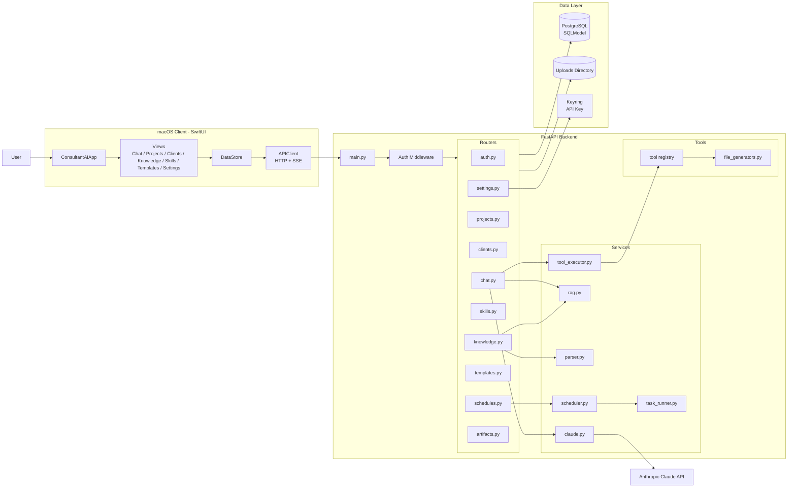
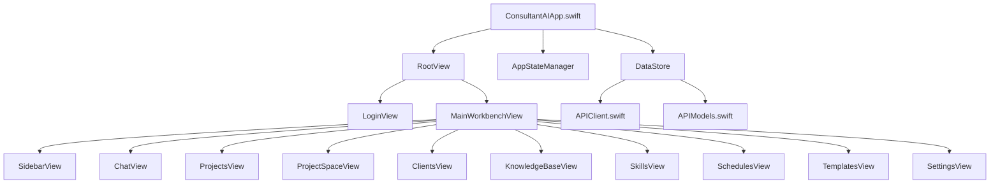
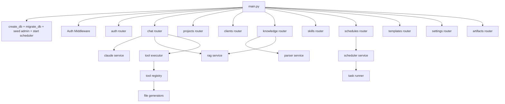
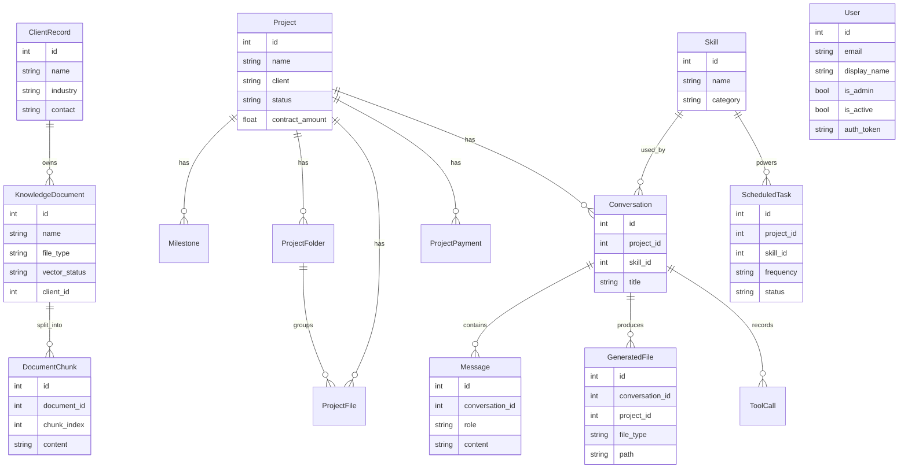
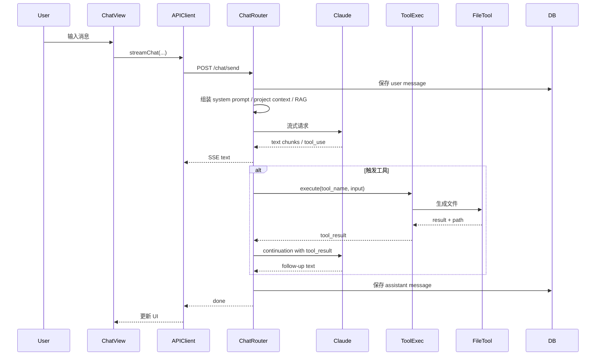
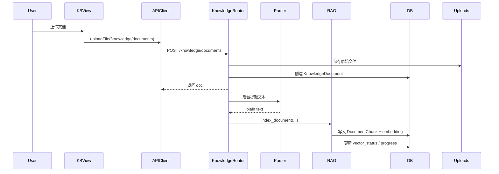
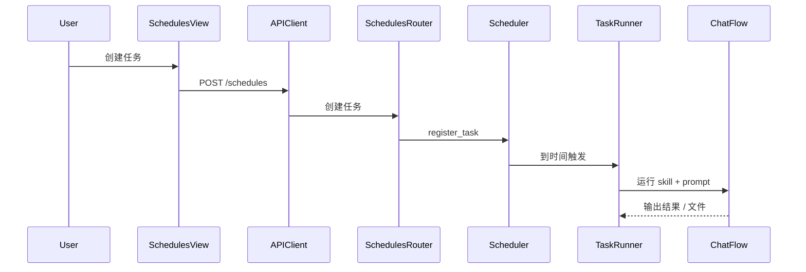

# AriaAI 当前架构图

> 日期：2026-03-26  
> 说明：本图基于当前仓库实际代码结构整理，反映的是“现在的系统”，不是未来目标架构。

---

## 1. 总览图

---

## 2. 前端结构图

---

## 3. 后端结构图

---

## 4. 数据模型关系图

---

## 5. 关键链路图

## 5.1 聊天与工具调用链路

---

## 5.2 知识库上传与索引链路

---

## 5.3 定时任务链路

---

## 6. 当前架构特点

### 优点

- 前后端职责大致清晰
- 已经具备完整的业务骨架
- 聊天、知识库、技能、项目、交付物基本串起来了
- 数据模型已经覆盖了实际业务对象

### 当前瓶颈

- 聊天路由承担职责过多
- RAG 仍偏轻量实现
- 工具执行与交付物生成耦合较深
- 异步任务状态还不够统一
- 现架构更像单体应用，后续扩展会面临边界划分压力

---

## 7. 后续演进建议

如果后面要从当前架构继续演进，建议优先往这几个方向拆：

- `context builder`
- `retrieval service`
- `generation service`
- `task state / background jobs`

这几个拆出来之后，当前架构会更容易往：

- Vercel 轻 API + 外部 worker
- 主后端 + AI 子服务
- 单体到模块化单体

这样的路线继续演进。
