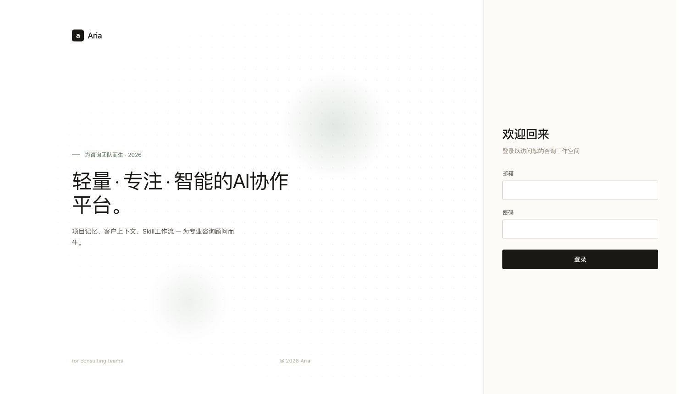

# AriaAI

AriaAI is an open-source agentic workspace for professional knowledge work.

It explores how AI systems can work with long-lived project memory, client context, reusable skills, knowledge workflows, human-in-the-loop approvals, and auditable agent runs. The goal is not to build another SaaS dashboard or a generic chatbot, but to prototype an AI-native workspace where professional teams can turn context into reliable delivery.

中文简介：

AriaAI 是一个面向专业知识工作的开源 Agentic Workspace。它关注的不是单次聊天，而是 AI 如何长期理解用户、项目、客户、知识与交付过程，并把这些能力组织成可追踪、可复用、可沉淀的工作系统。

## Why This Exists

Most AI tools still treat work as isolated prompts. Real professional work is different:

- projects have history, risk, files, tasks, and delivery constraints;
- clients have long-term preferences, decision patterns, and relationship context;
- teams need reusable methods, not just one-off answers;
- important AI actions need review, traceability, and rollback paths;
- knowledge needs to become part of a workflow, not just a search result.

AriaAI is an open experiment in this direction: an AI-native workspace with memory, skills, knowledge retrieval, tool use, and human approval as first-class product concepts.

## Core Capabilities

- **Project memory**: structured project context, progress, risks, open questions, delivery signals, and generated summaries.
- **Client memory**: long-term client context across projects, including reusable lessons, preferences, and relationship signals.
- **Agentic chat**: project-aware and workspace-aware chat with streaming output, tool calls, RAG context, and generated artifacts.
- **Skill workflows**: reusable professional workflows with ordered package roots, immutable content fingerprints, incremental refresh, and DB-published intent selection.
- **Knowledge workflows**: document ingestion, retrieval, source-aware context, and future integration with project/client memory.
- **Human-in-the-loop approvals**: server-side pending actions with versioned, tamper-evident execution envelopes for high-risk write/delete/update operations.
- **Native run harness**: per-turn tool-aware context budgeting, side-effect-aware model retry, ordered run checkpoints, explicit tool policy, fail-closed tool call/result normalization, and version-checked Markdown patches with reviewable diffs and rollback.

## Architecture

```text
AriaAI
  ├─ web/                 React 19 + TypeScript + Vite
  ├─ backend/             FastAPI + SQLModel + Alembic
  ├─ skills/              reusable Skill packages and method prompts
  ├─ docs/                product, architecture, memory, Skill, and harness design
  └─ .github/             workflows and contribution templates
```

Technology stack:

- Frontend: React 19, TypeScript, Vite, React Router, Tailwind CSS, i18next
- Backend: FastAPI, SQLModel, Alembic
- Database: PostgreSQL, with SQLite-compatible development paths
- AI: model provider configuration, project/client context, RAG, tools, and Skill prompts
- Runtime: APScheduler, SSE streaming, migration governance, task monitoring

## Quick Start

Use Python 3.9–3.12 (CI uses 3.11), Node.js 24, and a local PostgreSQL database. The pinned embedding dependencies do not support newer Python versions. Read [agent.md](agent.md) before changing code and [CONTRIBUTING.md](CONTRIBUTING.md) for the test workflow.

Create a PostgreSQL database for development, then prepare the backend from the repository root:

```bash
cd backend
python3.11 -m venv .venv
.venv/bin/python -m pip install -r requirements.txt -r requirements-test.txt
cp -n .env.example .env
```

Edit `backend/.env` before starting. Keep an existing `.env` if you already have one.

| Setting | Purpose |
| --- | --- |
| `DATABASE_URL` | Your local PostgreSQL connection; create the database first. |
| `ADMIN_EMAIL`, `ADMIN_PASSWORD` | Initial administrator account; there is no default login password. |
| `JWT_SECRET` | A strong private secret required at startup and for signed runtime envelopes. |
| `CORS_ORIGINS` | Include the frontend origin, normally `http://localhost:5173`. |
| `SCHEDULER_ENABLED` | Set `false` if local scheduled execution is not needed. |
| `DEFAULT_LLM_PROVIDER` and provider API key | Configure a supported provider to run actual AI requests. |
| `KNOWLEDGE_EMBEDDING_PROVIDER` | `hash` for the offline baseline; see the [semantic retrieval guide](docs/24-知识语义检索与质量验收.md) before enabling `fastembed`. |

Run migrations and start the API from `backend/`:

```bash
.venv/bin/python scripts/migration_governance.py report
.venv/bin/python scripts/migration_governance.py ensure
.venv/bin/python scripts/migration_governance.py upgrade
.venv/bin/python scripts/migration_governance.py check
.venv/bin/python -m uvicorn main:app --host 127.0.0.1 --port 8000 --reload
```

In another terminal, start the frontend from the repository root:

```bash
cd web
npm ci
npm run dev
```

Open `http://localhost:5173` and sign in with your configured administrator account. The API health endpoint is `http://127.0.0.1:8000/health`. If a previous browser setting points at another server, reset it through server settings; `web/src/config/api.ts` owns URL selection. Production uses `/api` by default.

The login screen below was captured from the local production build, with empty credentials and no customer data:



See the [architecture overview](docs/07-AriaAI架构与对话逻辑图.md) for the system and chat diagrams. Login grants identity; project membership, client relationships, Source permissions, and HITAS still control access and consequential actions.

Before submitting frontend changes:

```bash
cd web
npm run lint -- --max-warnings=0
npm test
npm run build
```

Run backend tests against an isolated test database. For the SQLite-compatible checks, use a temporary file so HTTP worker threads share the same database:

```bash
cd backend
ARIA_TEST_DB=$(mktemp /tmp/aria-tests.XXXXXX)
TEST_DATABASE_URL="sqlite:///$ARIA_TEST_DB" .venv/bin/python -m pytest -q \
  tests/test_agent_harness_native.py tests/test_product_run_events.py \
  tests/test_knowledge_retrieval.py tests/test_knowledge_conversation_access.py
.venv/bin/python scripts/project_chat_quality_eval.py
.venv/bin/python scripts/knowledge_retrieval_eval.py --enforce
```

PostgreSQL-specific tests need a separate PostgreSQL test database; see [CONTRIBUTING.md](CONTRIBUTING.md). See [DEPLOY.md](DEPLOY.md) for production backup, migration, Actions, and verification requirements.

## Documentation

Start with the [documentation index](docs/README.md), which labels implemented contracts, historical plans, current changes, and their roadmap issues. Recommended reading path:

1. [Project Overview](docs/00-项目总览.md)
2. [Product Strategy](docs/01-产品战略方向.md)
3. [Skill System](docs/02-Skill体系.md)
4. [Skill Standardization](docs/03-Skill标准化规范.md)
5. [RAG Evolution](docs/04-RAG演进方案.md)
6. [Conversation System](docs/05-对话系统设计与规范.md)
7. [Human-in-the-Loop Tool Approval](docs/06-Human-in-the-Loop%20Tool%20Approval%20设计.md)
8. [Architecture and Chat Logic](docs/07-AriaAI架构与对话逻辑图.md)
9. [Skill Roadmap](docs/08-Skill体系评估与优化路线图.md)
10. [Skill Authoring Guide](docs/09-Skill编写规范.md)
11. [Model + Harness Product Design](docs/11-Model-Harness产品方案设计.md)
12. [Memory System Optimization](docs/12-记忆系统优化方案.md)
13. [Knowledge Base Development Plan](docs/14-V0.0.5知识库开发方案.md)
14. [Agentic Workspace Upgrade Design](docs/18-Agentic%20Workspace升级功能设计说明书.md)
15. [OSS Roadmap](docs/20-OSS-Roadmap.md)
16. [Codex Source Absorption and Native Harness Plan](docs/21-Codex-Harness集成与源码复用方案.md)
17. [Current Implementation and Acceptance](docs/23-2026-09-19全量推进验收.md)
18. [Semantic Retrieval Setup and Evaluation](docs/24-知识语义检索与质量验收.md)
19. [Preview Release Notes and Maintainer Checklist](docs/25-Agentic-Workspace-Preview-发布说明.md)

## Project Status

AriaAI is under active development. The repository is currently focused on:

- making the project and client memory layers reliable;
- turning Skills into delivery-oriented workflows;
- building a first-class knowledge base;
- improving the AI Run / Harness model;
- making the workspace usable for real professional delivery.

The codebase moves quickly, so some docs describe near-term design direction rather than completed implementation.

## Contributing

Contributions, issues, and design discussions are welcome. Good first areas:

- documentation improvements;
- Skill authoring examples;
- frontend polish and accessibility;
- tests for chat, memory, knowledge, and Skill workflows;
- backend reliability, migration, and task governance.

See [CONTRIBUTING.md](CONTRIBUTING.md) for the contribution guide.

## Community and Security

- [OSS Roadmap](docs/20-OSS-Roadmap.md)
- [Third-party Notices](THIRD_PARTY_NOTICES.md)
- [Security Policy](SECURITY.md)
- [Code of Conduct](CODE_OF_CONDUCT.md)
- [Pull Request Template](.github/pull_request_template.md)

## License

AriaAI is released under the [MIT License](LICENSE).
