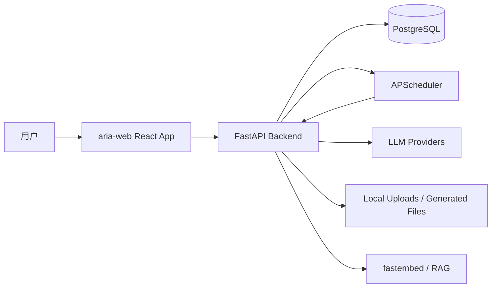
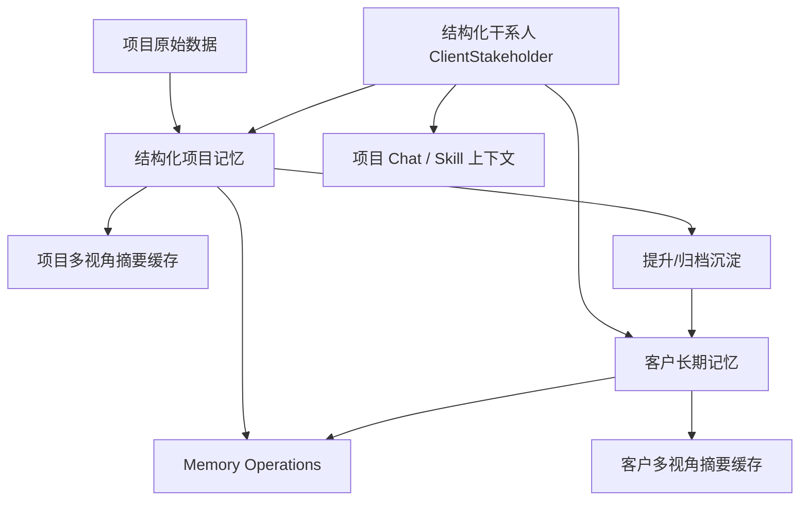

# AriaAI 项目总览

> 更新日期：2026-05-15
> 版本：V0.0.2+

---

## 1. 项目定位

AriaAI 是咨询团队的**客户关系智能系统**。

顾问的核心痛点不是"没有好用的 AI 工具"，而是"每次找 AI 帮忙都要重新交代背景"。通用 AI（Claude.ai、ChatGPT）正在解决事实性上下文，但有一个部分是结构性空白，大厂不会深入：

- **关系性判断**：这个决策人真正在意什么、敏感点在哪、怎么沟通最有效——这不是事实，是从多次交互里提炼出来的判断
- **组织记忆**：客户是公司的客户，不是某一个人的；有人离职、项目移交，背景应该传承
- **跨项目经验沉淀**：第一期踩的坑，第三期不应该重踩；通用工具的项目是孤立文件夹
- **行为触发捕获**：有价值的上下文在做事时产生，不应该等用户手工整理

**北极星场景**：顾问在客户会议前 30 秒打开 AriaAI，看到这次该说什么、该避什么、该推进什么——这件事 Claude.ai、CRM、Notion 都做不到。

当前产品主线：

- 用项目承载长期上下文和交付过程。
- 用客户记忆沉淀跨项目经验、偏好和关系信号。
- 用结构化干系人描述客户侧关系网络，并注入 AI 上下文。
- 用 Skill 承载可复用的方法论与任务模板，并直接从项目/客户空间启动。
- 用统一任务面板治理记忆重建、摘要预热、失败重试和预算。
- 用 Alembic 迁移治理保证部署可靠性。

战略详见 [03-产品战略方向](03-产品战略方向.md)。

---

## 2. 技术栈

| 层 | 技术 |
|---|---|
| 前端 | React 19, TypeScript, Vite, React Router 7, Tailwind CSS 4, i18next |
| 后端 | FastAPI, Uvicorn |
| ORM | SQLModel（SQLAlchemy Core + Pydantic） |
| 数据库 | PostgreSQL |
| 迁移 | Alembic |
| 调度 | APScheduler |
| RAG | fastembed + 余弦相似度检索 |
| 加密 | cryptography.fernet（凭证 Vault） |
| LLM | Anthropic SDK + OpenAI-compat（Kimi / BigModel / DeepSeek） |
| 文档生成 | python-pptx, python-docx, openpyxl, reportlab |
| PDF 处理 | pypdf, pdfplumber |

---

## 3. 系统架构

### 3.1 总体架构



### 3.2 前端目录结构

```text
aria-web/src/
├── api/
├── components/
├── config/
├── contexts/
├── pages/
│   ├── clients/
│   ├── projects/
│   ├── settings/
│   └── skills/
├── routeLoaders.ts
└── types/
```

关键页面：

| 页面 | 责任 |
|---|---|
| `pages/projects/ProjectDetail.tsx` | 项目详情路由壳 |
| `pages/projects/ProjectDetailLayout.tsx` | 项目详情布局与 Tab |
| `pages/projects/ProjectMemoryTab.tsx` | 项目记忆页，支持提升到客户记忆 |
| `pages/clients/ClientMemoryPage.tsx` | 客户记忆页 |
| `pages/settings/MemoryOperationsSettings.tsx` | 统一任务面板 |
| `pages/settings/MigrationSettings.tsx` | 迁移状态页 |
| `pages/skills/Skills.tsx` | Skill 管理页 |

### 3.3 后端目录结构

```text
AriaAI/backend/
├── app/
│   ├── routers/
│   ├── services/
│   ├── models/
│   ├── database.py
│   └── config.py
├── alembic/
│   └── versions/
├── scripts/
│   ├── ensure_db.py
│   └── migration_governance.py
├── tests/
└── data/ariaai.db
```

关键路由：

| 文件 | 责任 |
|---|---|
| `routers/projects.py` | 项目、项目记忆、项目任务、项目摘要 |
| `routers/clients.py` | 客户、客户记忆、客户干系人 CRUD、客户摘要 |
| `routers/skills.py` | Skill CRUD、Skill 种子、Consulting Capability 目录 |
| `routers/chat.py` | 聊天主路由，含 conversations / diagnostics / export / plan / async / actions |
| `routers/chat_actions.py` | HITAS 人机回环审批（confirm / reject / batch / list） |
| `routers/auth.py` | 登录、用户、Token |
| `routers/health.py` | 健康检查与迁移状态 |

关键服务：

| 文件 | 责任 |
|---|---|
| `services/project_contexts.py` | 项目上下文、项目记忆、摘要缓存 |
| `services/client_contexts.py` | 客户记忆、客户摘要 |
| `services/stakeholder_contexts.py` | 结构化干系人序列化与 prompt formatter |
| `services/credential_vault.py` | Fernet 对称加密，外部服务凭证存储 |
| `services/scheduler_service.py` | 后台任务调度（APScheduler） |
| `services/chat_streaming.py` | 流式聊天编排（SSE、工具调用、token 管理） |
| `services/chat/phases/p0_durable_task.py` ~ `p4_persist.py` | 聊天 P0-P4 分段执行 |
| `services/chat/action_executor.py` | HITAS 确定性工具执行器（绕过 LLM） |
| `services/project_documents.py` | 项目文档保存与合并 |
| `services/context_builder.py` | 汇聚 Skill + 项目/客户记忆 + RAG + 干系人 → AI 上下文 |
| `tools/office_documents.py` | Office 文档生成（PPTX/DOCX/XLSX/PDF）+ 编辑 |
| `tools/pdf_tools.py` | PDF 合并/拆分/提取/读取/水印 |

### 3.4 迁移链

```
001_v1_1 → 002_v1_2 → 003_v1_3 → 004_v1_4 → 005_v1_5
→ 006_v1_6（ClientStakeholder 结构化干系人表）
→ 007_v1_7（ProjectMemorySnapshot 项目记忆快照表）
→ 008_v1_8（ClientMemorySnapshot 客户记忆快照表）
→ 009_v1_9（记忆快照 diff 与回滚接口）
→ 010_v1_10（Memory Operations 服务端汇总接口）
→ ...（中间迭代）...
→ 014_v1_14（HITAS approval_batch_id + PendingToolAction 扩展字段）
→ 015_v1_15（Conversation owner scope）
→ 016_v1_16（HITAS schema guard，幂等校验生产关键字段）
```

迁移治理能力：

- `scripts/migration_governance.py`：`report / json / check / ensure / upgrade / current`
- `ensure_db.py`：幂等补齐历史轻量库，不会把非空 revision 盲目 stamp 到 head
- 支持历史短号 alias 修复（如 `005` → `005_v1_5`）
- 部署脚本已接入 `report → ensure → upgrade → check`
- `/health/db` 与 `/health/db/migrations` 提供迁移状态

---

## 4. 核心能力全景

### 4.1 用户与安全

- 邮箱密码登录，`X-Auth-Token` 鉴权，多设备 Token 管理（`UserToken` 表）
- 用户管理、启停用、密码重置，登录失败限流（5 次 / 300 秒）
- 弱默认 `JWT_SECRET` 启动拦截，Markdown 链接协议基础过滤
- `credential_vault.py`：Fernet 对称加密存储外部服务凭证

### 4.2 项目工作台

- 项目 CRUD 与阶段流转（lead / opportunity / won / delivering / archived）
- 项目详情聚合，成员、里程碑、待办、财务、文档、笔记
- 项目概览 AI 总结与"今日行动"起点提示
- 项目级 Memory 页面：结构化记忆、多视角摘要、锚点编辑
- 项目概览新增 `ProjectSkillWorkflowsCard`，从项目简报、风险行动、客户沟通三个意图直接启动 Skill

### 4.3 项目聊天

- SSE 流式输出，工具调用支持与状态卡片可视化
- 标题自动生成，Markdown / PDF 导出
- 项目上下文注入（记忆版本、客户、文件、待办、里程碑、结构化干系人）
- 知识范围切换：项目 / 客户 / 全局，RAG 引用来源展示
- 生成物卡片与下载
- **HITAS 人机回环审批**：服务端持久化冻结工具参数，用户确认后确定性执行；支持批次级审批、运行时指标、stale reaper、长耗时工具后台执行；单例 claim 防止并发双执行；角色化授权（viewer 不可 confirm destructive）
- Skill 工作流联动：从项目概览进入 Skills，选择后带项目上下文返回项目 Chat 预填执行
- Skill 结果可保存为项目文档/项目笔记，并触发项目记忆刷新

### 4.4 会前简报 V1

- 项目级会前简报：把项目记忆、客户记忆、结构化干系人、待办和里程碑聚合为"会议前 30 秒"卡片
- 后续方向：加入 AI 优化版、会议类型、最近沟通来源和一键带入 Chat

### 4.5 Skill 工作流

- Skill 从 Skill 列表进入项目/客户空间的一等启动入口，执行结果可沉淀为项目资产
- 数字化战略 Skill 支持执行清单、日志明细、生成物附件，并强制使用 `digital-strategy` PPT 模板
- Skill 能力分类新增"顾问基础能力"，将通用顾问能力从业务运营中拆出并按二级能力组织
- **新增 Skill**：目标定义（SMART/OKR）、会议纪要提取、Office 文档编辑、PDF 工具箱
- **新增工具**：`edit_project_office_document`（编辑现有 PPTX/DOCX/XLSX）、`manage_pdf`（合并/拆分/提取/读取/水印）

### 4.6 记忆系统（五层）

- **第一层**：原始业务上下文（项目数据、文档、聊天）
- **第二层**：结构化项目记忆 `Project.context_memory_json`
- **第三层**：项目多视角摘要缓存（7 种视角）
- **第四层**：客户长期记忆 `ClientRecord.client_memory_json`（8 种视角）
- **第五层**：结构化干系人 `ClientStakeholder`（客户侧关系网络）

后台治理：

- 项目/客户记忆任务统一面板（V2）
- 失败分类：`budget / rate_limit / timeout / database / data / scheduler / llm / unknown`
- 失败明细、建议动作、直接重试
- 项目/客户摘要预热预算，失败告警汇总
- `GET /memory/operations/summary` 服务端聚合统计

### 4.7 结构化干系人（含变更历史）

- `ClientStakeholder` 独立实体：姓名、角色、组织层级、影响类型、关系状态、关注点、敏感点、沟通偏好、联系方式、最近动作
- Alembic 迁移 `006_v1_6`，`ensure_db.py` 幂等补齐
- 客户干系人 CRUD API：`GET/POST/PUT/DELETE /clients/{client_id}/stakeholders`
- `stakeholder_contexts.py`：统一负责结构化干系人序列化与 prompt formatter
- 项目记忆、客户记忆、项目 Chat/Skill 三条 AI 链路均消费结构化干系人
- 项目干系人页与客户详情页均提供同源维护卡片

### 4.8 客户记忆（跨项目沉淀）

- 项目归档自动沉淀，项目记忆手动提升
- 客户范围聊天注入，客户多视角摘要与预热
- 客户记忆后台重建排队、失败重试与指数退避
- 项目干系人页可读取客户记忆中的关键联系人、决策模式和敏感议题

### 4.9 记忆版本化（快照、diff、回滚）

- `ProjectMemorySnapshot` 和 `ClientMemorySnapshot` 快照表已落地（迁移 `007` / `008`）
- 项目记忆页与客户记忆页支持查看最近快照并回滚到历史版本
- Diff 接口：`GET .../snapshots/{id}/diff`，按字段展示新增、移除和修改内容
- 回滚操作生成新版本，历史快照不被覆盖
- 后续可扩展为任意两快照互比、字段级审计备注、批量快照治理

### 4.10 统一任务治理

- 同时查看项目/客户记忆任务，任务类型：`rebuild / summary_warm`
- 搜索、范围筛选、任务类型筛选、重试状态筛选、失败类型筛选
- 失败明细侧栏，从失败记录直接重试
- 摘要预热预算展示、低预算提示、失败告警汇总
- 服务端 summary 聚合，标记 `database / data / unknown` 为 `manual_attention`

### 4.11 迁移治理

- Alembic 正式迁移链路（当前最新 `010_v1_10`）
- `migration_governance.py` 运维脚本，`ensure_db.py` 幂等补齐
- GitHub Actions / deploy 脚本接入迁移治理流程
- `/health/db` 与 `/health/db/migrations` 提供迁移状态
- 设置页新增 Migration Status
- 部署中 502/503/504 前端错误态已改为服务恢复提示

### 4.12 LLM Provider 支持

- Anthropic Claude（主力，含 Opus / Sonnet / Haiku 系列）
- Kimi（Moonshot）：默认 `kimi-k2.6`，K2 采样参数 `temperature=1.0, top_p=0.95`
- BigModel（自定义 OpenAI-compat 链路）
- `provider_selector.py` 统一路由，模型别名归一化

### 4.13 系统通知

- 首页一次性系统通知卡，`ensure_db.py` 幂等注入版本升级公告
- 复用 `SystemMessage` / `SystemMessageRead`

---

## 5. 记忆系统架构

### 5.1 架构总览



五层架构：

| 层 | 内容 | 存储 |
|---|---|---|
| L1 原始业务上下文 | 项目数据、文档、聊天、客户资料 | 原始业务表 |
| L2 结构化项目记忆 | AI 提炼的结构化记忆 | `Project.context_memory_json` |
| L3 项目视角摘要 | 按视角缓存的摘要 | `ProjectMemorySummary` 表 |
| L4 客户长期记忆 | 跨项目沉淀的经验、偏好 | `ClientRecord.client_memory_json` |
| L5 结构化干系人 | 客户侧关系网络 | `ClientStakeholder` 表 |

### 5.2 Project.context_memory_json 字段表

| 字段 | 说明 |
|---|---|
| `project_brief` | 项目简介 |
| `current_stage` | 当前阶段 |
| `current_objective` | 当前目标 |
| `recent_progress` | 近期进展 |
| `key_risks` | 关键风险（支持 `ai + pinned` 双层） |
| `open_questions` | 开放问题（支持 `ai + pinned` 双层） |
| `next_actions` | 下一步行动 |
| `important_documents` | 重要文档 |
| `financial_status` | 财务状态 |
| `delivery_signals` | 交付信号 |
| `stakeholder_notes` | 干系人提示（支持 `ai + pinned` 双层） |
| `memory_version` | 记忆版本号 |
| `last_updated_at` | 最后更新时间 |
| `stale` | 是否过期 |
| `rebuild_log` | 重建日志 |
| `_coverage` | 覆盖度元数据 |
| `_client_promotion` | 客户提升元数据 |
| `_last_failure` | 最后失败信息 |

扩展能力：`memory_stale / memory_version / memory_updated_at` 状态管理，`memory_rebuild_status / memory_rebuild_failed_at` 异步重建状态（`idle / queued / rebuilding / failed`），槽位级增量更新，手动提升到客户记忆，AI 记忆锚点独立治理页。

### 5.3 ClientRecord.client_memory_json 字段表

| 字段 | 说明 |
|---|---|
| `client_profile` | 客户画像 |
| `decision_patterns` | 决策模式 |
| `key_contacts` | 关键联系人 |
| `lessons_learned` | 经验教训 |
| `project_history` | 项目历史 |
| `sensitive_topics` | 敏感议题 |
| `source_project_ids` | 来源项目 ID |
| `memory_version` | 记忆版本号 |
| `last_updated_at` | 最后更新时间 |
| `stale` | 是否过期 |
| `rebuild_log` | 重建日志 |
| `_last_failure` | 最后失败信息 |

### 5.4 七种项目摘要视角

| 视角 | 说明 |
|---|---|
| `overview` | 项目全貌概览 |
| `risk` | 风险与阻塞项 |
| `stakeholder` | 干系人关系与动态 |
| `delivery` | 交付进展与里程碑 |
| `client-facing` | 面向客户的表述建议 |
| `financial` | 财务与商务视角 |
| `documents` | 文档与知识库总结 |

缓存键：`project_id + memory_version + summary_type + language`

### 5.5 八种客户摘要视角

| 视角 | 说明 |
|---|---|
| `overview` | 客户全貌概览 |
| `stakeholder` | 干系人网络与关系 |
| `lessons` | 跨项目经验教训 |
| `client-facing` | 客户沟通建议 |
| `risk` | 关系风险与敏感点 |
| `opportunity` | 商业机会与拓展 |
| `relationship` | 关系状态与维护策略 |
| `delivery` | 交付质量与历史 |

### 5.6 干系人模型

在 AI 总结、项目记忆和客户记忆里，"干系人"专指**客户侧关系网络**，而不是内部项目成员。

分类：

| 类型 | 说明 |
|---|---|
| 联系人 | 日常沟通对象、业务接口人、采购或商务接口 |
| 决策人 | 能影响预算、验收、采购、续约或项目方向的人 |
| 使用方 | 最终使用系统、服务或交付物的人 |
| 影响方 | 法务、财务、IT、安全、品牌等会影响推进节奏的人 |

`ClientStakeholder` 字段：

| 字段 | 说明 |
|---|---|
| 姓名 | 干系人姓名 |
| 角色 | 在客户组织中的角色 |
| 组织层级 | 层级位置 |
| 影响类型 | 决策/使用/验收/采购/财务/法务/IT/安全 |
| 关系状态 | supportive / neutral / blocked / unknown |
| 关注点 | 该干系人关注的核心议题 |
| 敏感点 | 需要避免或谨慎处理的议题 |
| 沟通偏好 | 沟通方式与风格偏好 |
| 联系方式 | 联系渠道 |
| 最近动作 | 最近与该干系人的关键交互 |
| 备注 | 其他补充信息 |

---

## 6. 核心对象模型

| 对象 | 说明 |
|---|---|
| `Project` | 最核心的业务容器，聚合文件、里程碑、财务、笔记、待办、聊天、记忆 |
| `ClientRecord` | 客户长期资产，跨项目沉淀经验、偏好、记忆 |
| `ClientStakeholder` | 客户侧关系网络，独立结构化实体（角色、影响类型、关系状态等） |
| `Conversation` | 一次协作过程，可挂接 `project_id` 和 `skill_id` |
| `Skill` | 可执行的方法论模板，含 `system_prompt`、`user_template`、`tools_definition_json` |
| `KnowledgeDocument` | 可检索资料来源，状态：`pending → processing → synced / failed` |
| `ProjectMemorySummary` | 项目多视角摘要缓存（overview / risk / stakeholder / delivery 等） |
| `ProjectMemorySnapshot` | 项目记忆历史快照，支持 diff 与回滚 |
| `ClientMemorySnapshot` | 客户记忆历史快照，支持 diff 与回滚 |
| `ExternalServiceCredential` | Fernet 加密的外部服务凭证，支持 system / user 两种 scope |

---

## 7. 设计原则

- **项目优先**：高价值 AI 能力优先挂在项目上下文中，而不是全局独立功能。
- **客户复用**：跨项目经验必须能回流到客户空间，形成可运营的客户资产。
- **沉淀优先**：AI 结果要能变成文档、笔记、记忆或生成物，而不只是一次性聊天回答。
- **治理优先**：异步任务、迁移、失败和预算要可见、可处理、可配置。
- **交付优先**：输出要更接近邮件、摘要、PPT、报告，而不是更长的对话。
- **小步快跑**：每一轮交付一个可部署闭环，前端至少跑 `npm run build`，后端至少跑 `py_compile`。

---

## 8. 当前状态

| 能力 | 状态 | 备注 |
|---|---|---|
| 项目工作台 | ✅ 已完成 V1 | 后续继续体验优化 |
| 项目聊天 | ✅ 已完成 V1 | 支持引用、工具、生成物、Skill 联动 |
| 项目空间 Phase 1 | ✅ 已完成 | 结构化记忆、多视角摘要、锚点编辑 |
| 项目空间 Phase 2 | ✅ 已完成 | auto-md 自动归档 |
| 会前简报 V1 | ✅ 已完成 | 聚合项目/客户记忆、干系人、待办、里程碑 |
| Skill 工作流 | ✅ 已完成基础闭环 | 项目/客户空间启动 → Chat 执行 → 保存沉淀 |
| 记忆系统（五层） | ✅ 已完成 V1 | 五层架构全链路打通 |
| 结构化干系人 | ✅ 已完成 | 独立实体、CRUD、AI 上下文注入、前端维护、变更历史 |
| 客户记忆 | ✅ 已完成 V1 | 跨项目沉淀、手动/自动提升、多视角摘要 |
| 记忆版本化 | ✅ 已完成基础 | 快照表、diff、回滚已落地，后续补审计说明 |
| 统一任务面板 | ✅ 已完成 V2 | 服务端聚合统计已接入 |
| 迁移治理 | ✅ 已完成基础闭环 | 已接入部署脚本和设置页，最新 016_v1_16 |
| HITAS 人机回环 | ✅ 已完成 v1.3 | Batch 审批、hash 去重、superseded、角色化授权 |
| Office 文档编辑 | ✅ 已完成 | `edit_project_office_document` 支持 PPTX/DOCX/XLSX |
| PDF 管理 | ✅ 已完成 | `manage_pdf` 支持合并/拆分/提取/读取/水印 |
| 凭证 Vault | ✅ 已完成服务层 | credential_vault.py，前端管理页待补 |
| Kimi K2.6 | ✅ 已完成 | 默认模型升级，K2 采样参数统一 |
| 首页系统通知卡 | ✅ 已完成 V1 | 复用 SystemMessage，后续可做投放配置 |
| Welcome 今日感 | ⏳ 部分完成 | 下一版本 P1 |
| 任务治理服务端化 | ⏳ 推进中 | 批量处理、告警配置化待完成 |
| Markdown/XSS 复核 | 🔄 基础加固 | Markdown 渲染白名单、script/style 剥离、危险链接拦截已落地；系统审计继续推进 |
| 性能与复杂度治理 | 🔄 持续推进 | HITAS 纯逻辑已从项目聊天主面板拆出；大路由/大组件继续拆分 |

### 摘要生成治理

- 多视角摘要已从"每个卡片独立触发"收敛为"同一项目/语言/记忆版本的生成全部请求前端合并"，减少重复 LLM 调用。
- 后端保留项目级 summary lock 兜底，同一项目、摘要类型、语言、记忆版本互斥生成。
- 摘要缓存两种状态：缓存不存在 → 尚未生成；缓存存在但内容为空 → 已生成但该维度缺少可总结信息。
- UTC 时间来源已统一到 `utc_now_naive()`。

### 下一版本主线

**Skill 规模化导入 + 对话系统规范化落地 + 治理深化**

优先级：

1. **Skill 标准化与批量导入**（P0）：建立 SKILL.md 标准格式 + 后端种子注册自动化流程，支持外部优质 Skill 快速接入
2. **对话系统规范化落地**（P0）：IntentRouter 五层管道（Policy Guards → Rule-First → LLM Router → Schema → Clamp）从 spec 落到代码；Prompt-as-Data 迁移
3. **会前简报深化**（P1）：加入 AI 优化版、会议类型、最近沟通来源和一键带入 Chat
4. **降低干系人捕获摩擦**（P1）：聊天中提到人名建议加入干系人
5. **用户验证**（P1）：找 5 个真实顾问在真实工作中使用北极星场景
6. 记忆快照 diff 视图深化和更细的审计说明
7. Memory Operations 服务端统计接口与批量治理
8. 后端大路由拆分（projects / clients / skills 子路由）
9. 安全基线：Markdown/XSS 系统复核、管理员接口权限与运行时告警接入

详细计划见 [02-技术债与行动清单](02-技术债与行动清单.md) §3 "当前 Sprint"，战略背景见 [03-产品战略方向](03-产品战略方向.md)。
