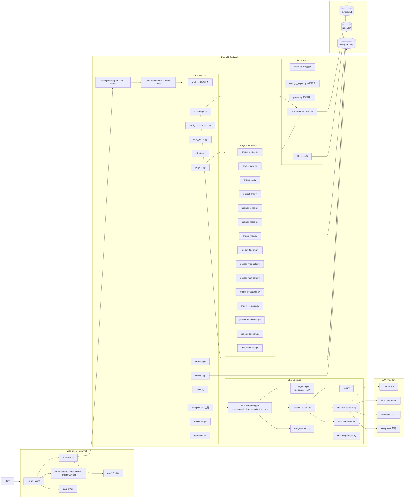

# AriaAI 当前架构图

更新日期：2026-04-17

这份文档描述的是当前代码已经落地的结构，不是理想蓝图。

## 1. 系统总览



## 2. 前端结构

### 2.1 项目页完整文件树

```
src/pages/projects/                          # 90+ 文件
│
├── # ── 路由与布局壳 ──────────────────────────
├── ProjectDetail.tsx                        # 路由壳 128 行
├── ProjectDetailLayout.tsx                  # 布局壳 53 行（Header + 持久化面板 + 路由内容）
├── PersistentProjectPanels.tsx              # Chat/Notes/Todos 持久化渲染 154 行
├── ProjectDetailHeader.tsx                  # 面包屑 + Tab 导航
├── projectDetailTabs.ts                     # Tab 配置（类型 / 路径 / i18n key）
├── projectDetailRouteConfig.tsx             # 路由装配（Overview/Documents/...）
├── useProjectDetailData.ts                  # 项目数据拉取 Hook
│
├── # ── 项目列表 ──────────────────────────────
├── Projects.tsx                             # 项目看板（按阶段分组）
├── ProjectsHeader.tsx                       # 列表页头部 + 新建入口
├── ProjectsPhaseSection.tsx                 # 阶段分组区块
├── ProjectKanbanCard.tsx                    # 看板卡片
├── ProjectKanbanPhaseHeader.tsx
├── ProjectKanbanStageColumn.tsx
│
├── # ── 新建项目 ──────────────────────────────
├── NewProject.tsx
├── NewProjectAIPanel.tsx                    # AI 建议面板
├── NewProjectBasicsForm.tsx
├── NewProjectClientSelect.tsx
├── NewProjectHeader.tsx
├── NewProjectStageSelector.tsx
│
├── # ── 概览 Tab ──────────────────────────────
├── ProjectOverviewTab.tsx
├── ProjectOverviewInfoCard.tsx
├── ProjectOverviewMilestonesCard.tsx
├── ProjectOverviewSummaryCard.tsx
├── ProjectOverviewDocumentsCard.tsx
├── ProjectOverviewNotesCard.tsx
├── ProjectOverviewSidebar.tsx
├── ProjectOverviewArtifactsCard.tsx         # ★ 项目生成物列表
├── useProjectOverviewData.ts
│
├── # ── 聊天 Tab ──────────────────────────────
├── ProjectChatTab.tsx
├── ProjectChatSidebar.tsx                   # 会话列表
├── ProjectChatHeader.tsx
├── ProjectChatMainPanel.tsx
├── ProjectChatMessages.tsx                  # 消息列表（含引用来源展示）
├── ProjectChatMessageBubble.tsx             # 消息气泡（role / content / references）
├── ProjectChatInput.tsx
├── ProjectChatEmptyState.tsx
├── ProjectChatExportDropdown.tsx
├── ProjectChatDeleteDialog.tsx
├── ProjectChatSaveModal.tsx
├── ProjectChatSaveForm.tsx
├── ProjectChatArtifactCard.tsx              # ★ 生成物卡片（文件类型 + 下载）
├── ProjectChatToolCallCard.tsx              # ★ 工具调用状态卡片（running/done/error）
├── useProjectChatConversations.ts           # 会话加载 / 切换 Hook
├── useProjectChatComposer.ts               # 发送 / SSE 流式 / references Hook
├── useProjectChatPanel.ts
├── useProjectChatSaveModal.ts
├── projectChatCopy.ts                       # 文案常量
│
├── # ── 笔记 Tab ──────────────────────────────
├── ProjectNotesTab.tsx
├── ProjectNotesSidebar.tsx
├── ProjectNotesFolderTree.tsx
├── ProjectNotesContentPanel.tsx
├── ProjectNotesToolbar.tsx
├── ProjectNotesAIModal.tsx
├── ProjectNotesDialogs.tsx
├── ProjectNotesDocumentDialog.tsx
├── ProjectNotesDeleteDialog.tsx
├── useProjectNotesDocuments.ts
├── useProjectNotesActions.ts
├── useProjectNotesAI.ts
├── useProjectNotesDocumentActions.ts
├── useProjectNotesUI.ts
├── projectNotesCopy.ts
│
├── # ── 待办 Tab ──────────────────────────────
├── ProjectTodosTab.tsx
├── ProjectTodosPanel.tsx
├── ProjectTodoItem.tsx
├── ProjectTodoCreateForm.tsx
├── ProjectTodoDeleteDialog.tsx
├── useProjectTodosManager.ts
├── ProjectUserPicker.tsx                    # 共享用户选择器
│
├── # ── 里程碑 Tab ────────────────────────────
├── ProjectMilestonesTab.tsx
├── ProjectMilestonesList.tsx
├── ProjectMilestoneModal.tsx
├── ProjectMilestonesProgressCard.tsx
│
├── # ── 财务 Tab ──────────────────────────────
├── ProjectFinancialsTab.tsx
├── ProjectFinancialsSummary.tsx
├── ProjectFinancialsTransactions.tsx
├── ProjectFinancialsPaymentModal.tsx
├── ProjectFinancialsPaymentForm.tsx
├── ProjectFinancialsContractAmountModal.tsx
├── ProjectFinancialsActions.tsx
│
├── # ── 文档 Tab ──────────────────────────────
├── ProjectDocumentsTab.tsx
├── ProjectDocumentsBrowser.tsx
├── ProjectDocumentsGridView.tsx
├── ProjectDocumentsListView.tsx
├── ProjectDocumentsToolbar.tsx
├── ProjectDocumentsUploadPanel.tsx
├── ProjectDocumentsContextMenu.tsx
├── ProjectDocumentsCreateFolderModal.tsx
├── ProjectDocumentsDeleteDialog.tsx
├── ProjectDocumentsEmptyState.tsx
├── useProjectDocumentsManager.ts
├── useProjectDocumentsView.ts
├── projectDocumentsIcons.tsx
│
├── # ── 设置 Tab ──────────────────────────────
├── ProjectSettingsTab.tsx
├── ProjectSettingsFormCard.tsx
├── ProjectSettingsBasicFields.tsx
├── ProjectSettingsTextFields.tsx
├── ProjectSettingsFormFields.tsx
├── ProjectSettingsStageField.tsx
├── ProjectSettingsMembersCard.tsx
├── ProjectSettingsAIAssistant.tsx
├── ProjectSettingsDangerZone.tsx
├── ProjectSettingsDeleteDialog.tsx
├── useProjectSettingsEditor.ts
├── useProjectSettingsMembers.ts
│
└── # ── 工具函数 ──────────────────────────────
    ├── downloadArtifact.ts                  # ★ 生成物下载 helper
    └── downloadProjectFile.ts              # 项目文件下载 helper
```

### 2.2 Tab 渲染策略

| Tab | 渲染方式 | 原因 |
|-----|---------|------|
| Chat | 持久化（`PersistentProjectPanels` hidden 保活） | SSE 连接 + 会话状态 |
| Notes | 持久化 | 编辑器状态 + 文档树 |
| Todos | 持久化 | 表单草稿状态 |
| Overview / Documents / Milestones / Financials / Settings | React Router 按需渲染 | 无强状态需求 |

Tab 类型由 `ProjectDetailTabId`（TypeScript 类型）+ `PROJECT_DETAIL_TABS`（配置数组）+ `getActiveProjectDetailTabId()`（URL 解析函数）统一管理，存放于 `projectDetailTabs.ts`。

### 2.3 SSE 流事件类型（`StreamEvent`）

```typescript
type: 'conversation_id' | 'chunk' | 'text'     // 基础流
    | 'references'                               // RAG 引用来源
    | 'tool_executing' | 'tool_result'           // 工具调用过程
    | 'done' | 'error'
```

消息元数据（`MessageMetadata`）统一持久化：
```typescript
{
  references?: Reference[]      // RAG 引用（doc/file/milestone）
  tool_calls?: ToolCallEvent[]  // 工具调用历史
  artifacts?: GeneratedArtifact[] // 生成文件
  project_id?: number
}
```

### 2.4 共享基础设施

- `api/client.ts`：Axios 封装（`X-Auth-Token` 注入 + 401 重定向）
- `config/api.ts`：三源 API URL 解析（localStorage → `VITE_API_URL` → 默认）
- `contexts/AuthContext.tsx`：登录态 + 当前用户信息
- `contexts/ToastContext.tsx`：全局通知
- `contexts/ThemeContext.tsx`：暗/亮模式
- `i18n/index.ts`：zh-CN / en-US 双语，localStorage 持久化
- `types/api.ts`：全量类型（含 `ToolCallEvent` / `GeneratedArtifact` / `MessageMetadata` / `StreamEvent`）

## 3. 后端结构

### 3.1 Router 层（12 个）

| Router | 核心职责 | 新增特性 |
|--------|---------|---------|
| `auth.py` | 登录、用户 CRUD、多设备 Token | ★ 登录失败限流 |
| `chat.py` | SSE 流式聊天、会话 CRUD | ★ tool_executing / tool_result 事件 |
| `chat_conversations.py` | 会话列表与消息分页 | |
| `chat_export.py` | 对话导出 Markdown / PDF | |
| `projects.py` | 项目域所有接口（薄接口层） | |
| `knowledge.py` | 知识库文档上传 / 向量化 / 检索 | |
| `clients.py` | 客户 CRUD + AI 建议 | |
| `settings.py` | API Key 管理 + 三层配置读写 | |
| `skills.py` | Skill CRUD + 工具 schema 验证 | |
| `artifacts.py` | 生成文件列表 / 下载（安全路径校验） | |
| `schedules.py` | 调度任务 CRUD + 手动触发 | |
| `templates.py` | 文档模板管理 | |

### 3.2 Service 层

**聊天域：**

| Service | 职责 |
|---------|------|
| `chat_streaming.py` | SSE 流式，发送 `tool_executing` / `tool_result` / `references` 事件 |
| `chat_store.py` | 会话 / 消息持久化，`metadata_json` 写入 references / tool_calls / artifacts |
| `chat_diagnostics.py` | API provider 连通性测试 |
| `context_builder.py` | 上下文组装（project / client / global scope），文件内容注入 |
| `rag.py` | 向量检索，相似度排序，文档块召回 |
| `provider_selector.py` | LLM provider 路由 |
| `title_generator.py` | 对话标题生成（异步后台） |
| `tool_executor.py` | function calling 工具执行与格式化 |

**项目域（15 个独立模块）：**

| Service | 职责 |
|---------|------|
| `project_core.py` | 项目基础 CRUD |
| `project_details.py` | 详情聚合 `build_project_detail()` |
| `project_ai.py` | AI 建议提示词、文件摘要生成 |
| `project_llm.py` | 项目聊天模型选择 |
| `project_contexts.py` | 上下文数据拼装 + 摘要写回 |
| `project_documents.py` | Markdown 文档命名、写盘、merge 导出 |
| `project_files.py` | 文件上传、下载、删除 |
| `project_folders.py` | 文件夹 CRUD |
| `project_financials.py` | 财务记录 CRUD + 汇总（含 invoiced 类型） |
| `project_members.py` | 项目成员增删查 |
| `project_milestones.py` | 里程碑 CRUD |
| `project_notes.py` | 项目笔记保存 + AI 润色 |
| `project_todos.py` | 待办 CRUD + 跨项目聚合 |
| `project_deletion.py` | 项目级联删除编排 |
| `document_text.py` | 多格式文档文本提取（PDF / DOCX / PPTX / XLSX / TXT / MD） |

### 3.3 安全机制

```
启动时：
  JWT_SECRET 弱密钥检测 → 拒绝启动（可 ALLOW_INSECURE_JWT_SECRET=true 豁免）

登录接口：
  失败限流：5 次失败 / 300 秒窗口 → HTTP 429 + Retry-After
  限流键：IP + email 组合

Token 体系：
  主路径：UserToken 表（多设备，last_used_at 追踪）
  兼容路径：User.auth_token（旧版兼容，逐步淘汰）
  内存缓存：TTL=300s，减少 DB 查询压力
```

## 4. 数据层

### 4.1 核心表（19 个）

| 表名 | 说明 |
|------|------|
| `user` | 用户（admin / active / password_hash） |
| `usertoken` | 多设备 Token |
| `project` | 项目主表 |
| `projectfile` | 项目文件（AI 摘要） |
| `projectfolder` | 项目文件夹 |
| `projecttodo` | 待办（指派 / 截止日期） |
| `projectmember` | 项目成员 |
| `projectpayment` | 财务记录（received / expense / milestone_payment / invoiced） |
| `milestone` | 里程碑 |
| `conversation` | 会话（可挂载 project / skill） |
| `message` | 消息（`metadata_json` 存 references / tool_calls / artifacts） |
| `toolcall` | function calling 历史（工具名 / 输入 / 输出 / 状态） |
| `generatedfile` | AI 生成文件（PPT / Word / PDF / MD 等） |
| `knowledgedocument` | 知识库文档（双维归属） |
| `documentchunk` | 向量化文档块（embedding_json） |
| `skill` | Skill 模板（tools_definition_json） |
| `scheduledtask` | 调度任务 |
| `template` | 文档模板 |
| `clientrecord` | 客户 |
| `setting` | 键值对配置 |

### 4.2 数据库策略

- PostgreSQL 默认（`DEFAULT_POSTGRES_URL = postgresql://...`）
- SQLite 仅作本地开发 fallback
- Alembic 正式迁移路径，当前最新：`005_v1_5_todo_due_date`
- 启动时自动 `_fix_pg_sequences()`（防主键冲突）+ `_backfill_folders()`（历史项目补建默认文件夹）

## 5. API 接口速查

### 聊天域（含新增事件）

```
POST /chat/send          # SSE 流式
                         # events: conversation_id | chunk | text | references
                         #         tool_executing | tool_result | done | error
POST /chat/test-connection  # provider 连通性
POST /chat/test-model       # 模型可用性
```

### 项目域关键接口

```
GET    /projects/{id}/detail                               # 聚合详情
POST   /projects/{id}/notes/ai-polish-stream               # AI 润色 SSE
POST   /projects/{id}/generate-context                     # AI 摘要 SSE
POST   /projects/{id}/conversations/{conv_id}/save-markdown  # 沉淀为文档
GET    /projects/todos/my                                   # 跨项目我的待办
```

### 生成物接口

```
GET    /artifacts                   # 列出（按 conversation/project 筛选）
GET    /artifacts/{id}/download     # 下载（安全路径边界）
DELETE /artifacts/{id}              # 删除
```

## 6. 当前主要风险与待解事项

| 问题 | 状态 | 优先级 |
|------|------|-------|
| Alembic 迁移幂等性 + 部署健康检查 | ⏳ 待完成 | P0 |
| Skills 与项目空间联动 | ⏳ 待完成 | P1 |
| Welcome 工作台今日感强化 | ⏳ 待完成 | P2 |
| Markdown 渲染 XSS 防护复核 | ⏳ 待完成 | P1 |
| DeepSeek provider 接入 | ⏳ 待完成 | P2 |
| 项目查询性能与索引优化 | ⏳ 待完成 | P2 |

## 7. 后续建议

1. **Alembic 加固**：关键操作加 `IF NOT EXISTS` 保护，部署流加迁移失败中断
2. **Skill 与项目联动**：项目聊天页接入 Skill 选择器，执行结果可沉淀为项目文档
3. **Welcome 增强**：今日到期里程碑 / 待办 widget + 最近生成物快速访问
4. **XSS 复核**：`MarkdownRenderer.tsx` 确认 HTML 直通禁用，考虑引入 DOMPurify
