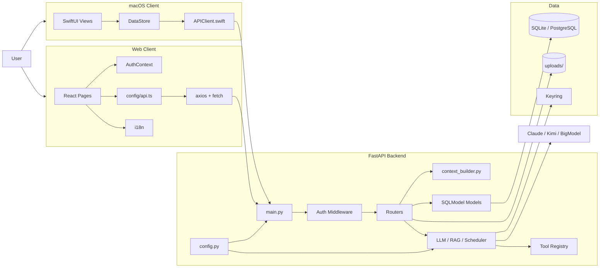
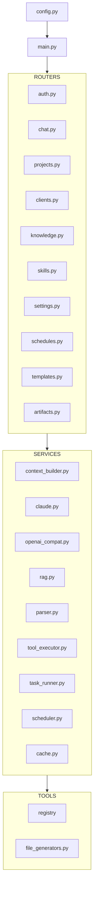

# AriaAI 当前架构图

> 更新日期：2026-04-12
> 说明：基于当前代码，不是未来目标架构

---

## 1. 系统总览

---

## 2. 后端结构

---

## 3. 当前架构特征

- 双客户端共享同一套后端 API
- 后端配置已开始集中
- 聊天上下文组装已从 `chat.py` 拆出
- Web API 配置已统一到单一模块
- 运行产物开始从仓库中清出

---

## 4. 当前架构风险

- `chat.py` 仍然偏重
- 枚举与标签仍未完全收敛
- 默认配置仍偏开发环境
- 残余乱码影响长期维护
