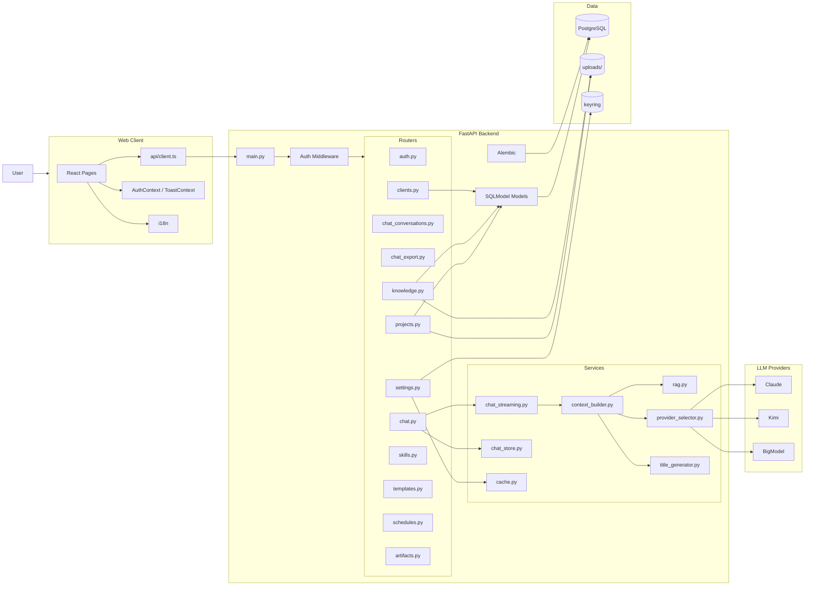

# AriaAI 当前架构图

更新日期：2026-04-14

这份文档描述的是当前代码已经落地的结构，不是理想态蓝图。

## 1. 系统总览

## 2. 前端结构

### 页面层

- `src/pages/Welcome.tsx`
- `src/pages/chat/Chat.tsx`
- `src/pages/projects/ProjectDetail.tsx`
- `src/pages/projects/ProjectChatTab.tsx`
- `src/pages/projects/ProjectNotesTab.tsx`
- `src/pages/projects/ProjectTodosTab.tsx`
- `src/pages/clients/*`
- `src/pages/knowledge/*`
- `src/pages/settings/*`

### 当前特点

- 项目空间已经是核心交互中心
- 项目聊天、文档、待办都在项目详情页内展开
- `ProjectDetail.tsx` 仍然偏重，是当前前端最需要继续拆分的文件之一

## 3. 后端结构

### Router 分层

- `auth.py`：登录、用户、token
- `chat.py`：聊天主入口
- `chat_conversations.py`：会话列表与详情
- `chat_export.py`：聊天导出
- `clients.py`：客户管理
- `knowledge.py`：知识库与检索
- `projects.py`：项目域核心逻辑
- `settings.py` / `skills.py` / `templates.py` / `schedules.py` / `artifacts.py`

### Service 分层

- `chat_streaming.py`：SSE 流式回复
- `chat_store.py`：会话与消息持久化
- `context_builder.py`：项目/知识库上下文组装
- `rag.py`：检索与排序
- `provider_selector.py`：LLM provider 选择
- `title_generator.py`：对话标题生成

### 当前特点

- 聊天域已经完成一轮模块化拆分
- 项目域能力增长很快，`projects.py` 已经成为新的复杂度中心
- 知识库与项目上下文开始走“隔离优先”的方向

## 4. 数据层

### 核心表

- `project`
- `projectfile`
- `projectfolder`
- `projecttodo`
- `projectmember`
- `conversation`
- `message`
- `knowledgedocument`
- `documentchunk`
- `user`
- `usertoken`

### 当前数据库策略

- PostgreSQL 是默认数据库
- Alembic 是正式迁移路径
- SQLite 仅保留为显式 fallback，不再作为推荐默认方案

### 当前迁移注意点

- 代码更新后需要显式执行 `alembic upgrade head`
- 线上曾出现“结构已存在但 alembic_version 落后”的情况
- 后续建议增加部署后的迁移校验和启动前检查

## 5. 最近新增或变化明显的能力

- 咨询售前项目文档模板
- 项目 Markdown 工作区
- 项目待办截至日期
- “我的待办”首页聚合
- `KnowledgeDocument.project_id`
- 项目聊天知识范围切换与隔离

## 6. 当前主要风险

- 项目域路由和前端项目详情页体量过大
- 迁移与数据库状态一致性需要更强保障
- 个别页面和历史文档仍有编码遗留
- 自动化测试覆盖仍集中在聊天主链路，项目/知识库/设置仍偏弱

## 7. 后续建议

1. 拆分 `projects.py` 为 notes / todos / files / financials / members 等子路由。
2. 拆分 `ProjectDetail.tsx`，减少 tab 间耦合。
3. 增加部署期数据库健康检查：
   - 当前迁移版本
   - 缺失列
   - 缺失表
4. 把文档与页面中文乱码继续系统性清理。
