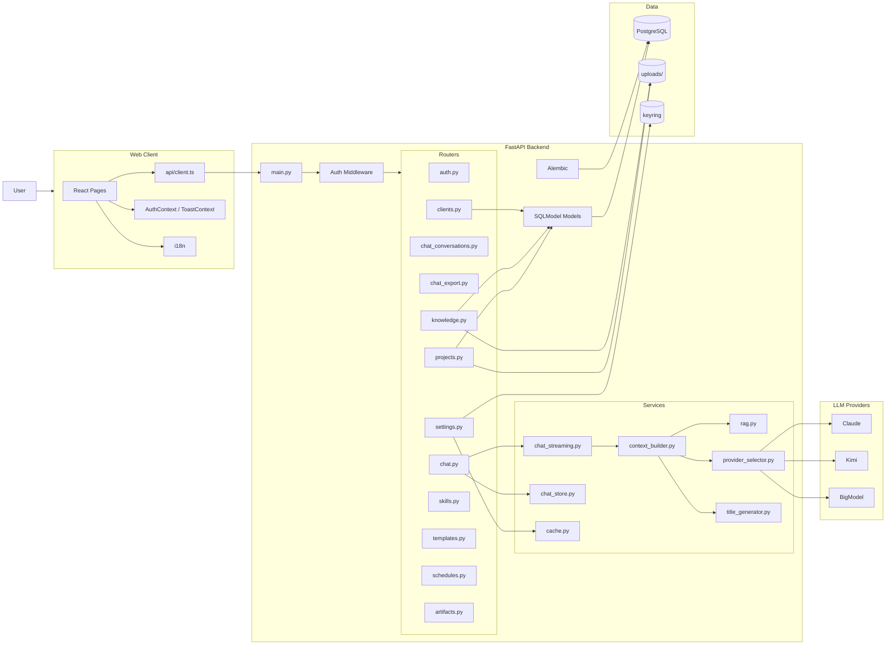

# AriaAI 当前架构图

更新日期：2026-04-15

这份文档描述的是当前代码已经落地的结构，不是理想蓝图。

## 1. 系统总览

## 2. 前端结构

### 2.1 页面层

- `src/pages/Welcome.tsx`
- `src/pages/chat/Chat.tsx`
- `src/pages/projects/ProjectDetail.tsx`
- `src/pages/projects/ProjectChatTab.tsx`
- `src/pages/projects/ProjectNotesTab.tsx`
- `src/pages/projects/ProjectTodosTab.tsx`
- `src/pages/clients/*`
- `src/pages/knowledge/*`
- `src/pages/settings/*`

### 2.2 当前特点

- 项目空间已经成为最核心的交互中心
- 项目聊天、项目文档、项目待办都在项目详情页内部展开
- `ProjectNotesTab.tsx` 最近新增了：
  - 站内弹窗新建 / 重命名 / 删除
  - AI 润色流式输出
  - “更多”菜单收口文档操作
- `ProjectDetail.tsx` 仍是当前前端最大的复杂度中心，但已经开始拆分出：
  - `ProjectDetailLayout.tsx`
  - `useProjectDetailData.ts`

## 3. 后端结构

### 3.1 Router 分层

- `auth.py`：登录、用户、token
- `chat.py`：聊天主入口
- `chat_conversations.py`：会话列表与详情
- `chat_export.py`：聊天导出
- `clients.py`：客户管理
- `knowledge.py`：知识库与检索
- `projects.py`：项目域核心逻辑
- `settings.py` / `skills.py` / `templates.py` / `schedules.py` / `artifacts.py`

### 3.2 Service 分层

- `chat_streaming.py`：SSE 流式回复
- `chat_store.py`：会话与消息持久化
- `context_builder.py`：上下文组装
- `rag.py`：知识检索与排序
- `provider_selector.py`：LLM provider 选择
- `title_generator.py`：对话标题生成

### 3.3 当前特点

- 聊天域已经做过一轮模块化拆分
- 项目域近期增速最快，`projects.py` 已经成为新的复杂度中心
- 上下文策略已经从“全局召回优先”转向“项目隔离优先”

## 4. 数据层

### 4.1 核心表

- `project`
- `projectfile`
- `projectfolder`
- `projecttodo`
- `projectmember`
- `conversation`
- `message`
- `knowledgedocument`
- `documentchunk`
- `user`
- `usertoken`

### 4.2 当前数据库策略

- PostgreSQL 是默认数据库
- Alembic 是正式迁移路径
- SQLite 仅作为显式 fallback，不再是推荐默认方案

### 4.3 当前迁移注意事项

- 代码更新后要显式执行 `alembic upgrade head`
- 当前迁移版本至少包括：
  - `003_v1_3_project_members`
  - `004_v1_4_knowledge_doc_project_id`
  - `005_v1_5_todo_due_date`
- 线上曾出现结构已存在但 Alembic 版本落后的情况，部署流程需要更强约束

## 5. 最近新增或变化明显的能力

- 咨询类售前项目文档模板
- 项目 Markdown 文档工作区
- 项目文档 AI 润色流式输出
- 项目待办截止日期
- 仪表盘“我的待办”显示日期
- `KnowledgeDocument.project_id`
- 项目聊天知识范围切换与隔离

## 6. 当前主要风险

- 项目域前后端都存在单文件过大的问题
- 迁移状态与真实数据库结构一致性仍需加强
- 少量页面和历史文档仍有编码污染
- 自动化测试仍更偏聊天主链路，对项目域覆盖不足

## 7. 后续建议

1. 拆分 `projects.py`，按 notes / todos / files / financials / members 等域继续下沉。
2. 拆分 `ProjectDetail.tsx`，减少 tab 间耦合。
3. 增加部署前后的数据库健康检查。
4. 继续清理中文乱码与历史文档污染。
