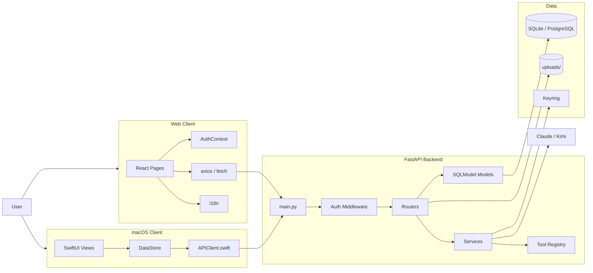
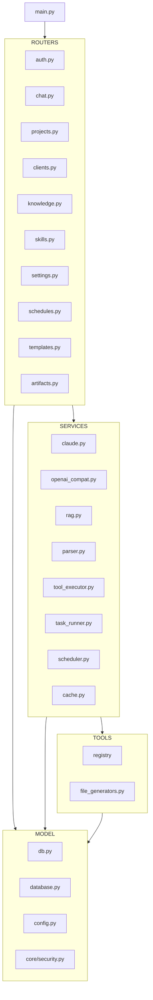
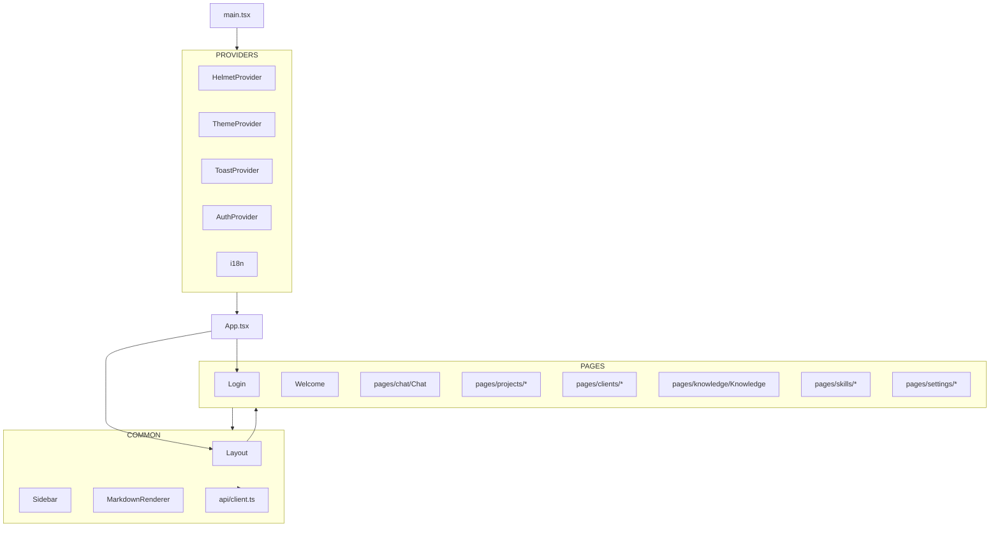
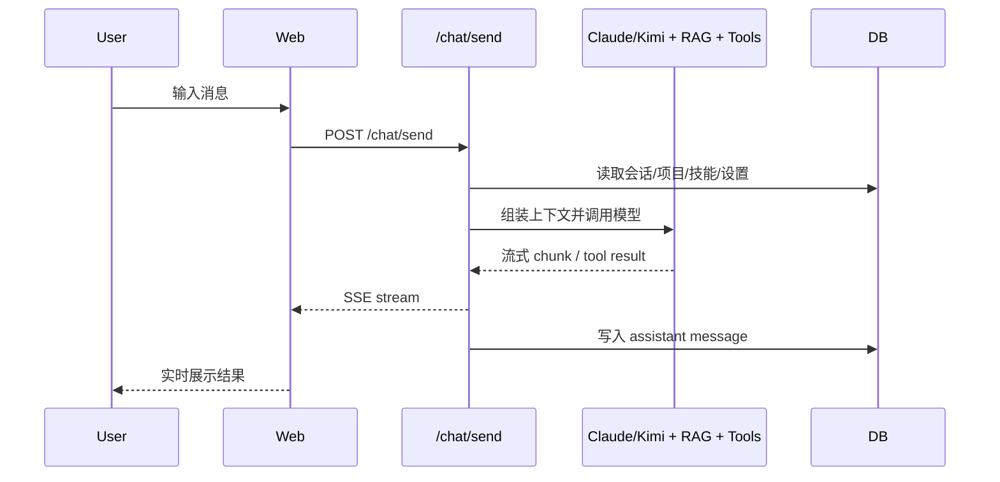
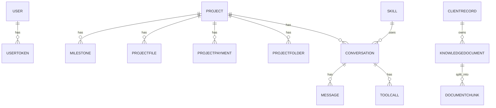

# AriaAI 当前架构图

> 更新日期：2026-04-12
> 说明：基于当前仓库代码，不是未来目标图

---

## 1. 系统总览

---

## 2. 后端分层

---

## 3. Web 前端结构

---

## 4. 聊天链路

---

## 5. 数据对象关系

---

## 6. 当前架构特征

- 双客户端共享同一后端 API
- 后端模块边界已基本形成
- 聊天路由承担较多编排责任
- 生成物和上传文件走本地文件系统
- RAG 与文件生成均内嵌在后端内

---

## 7. 当前架构主要风险

- Web 配置源不统一
- 聊天编排过重
- RAG 与数据层耦合较深
- 运行产物进入仓库
- 源码乱码影响长期维护
