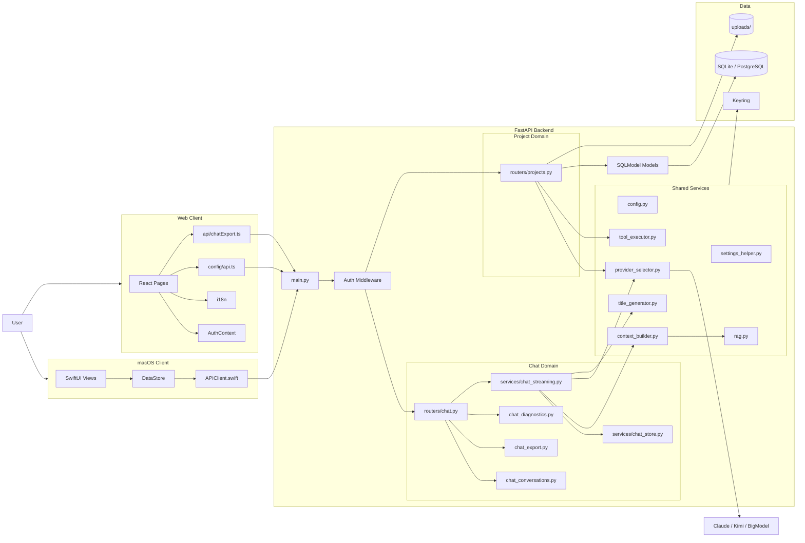

# AriaAI 当前架构图

> 更新日期：2026-04-14
> 说明：描述当前代码已实现的结构，不是目标态愿景图。

---

## 1. 系统总览

---

## 2. 当前架构特征

- 双客户端共用同一套后端 API
- 聊天域已经完成一次比较成功的模块化拆分
- 项目域能力持续增长，但边界仍偏粗
- Web API 配置已有统一入口，但尚未完全收口
- RAG 已经纳入统一上下文构建链路

---

## 3. 当前架构风险

- `projects.py` 和 `ProjectDetail.tsx` 已成为新的复杂度中心
- 文案与编码历史问题仍污染多个模块
- RAG 能力可用但仍偏基础
- 自动化测试主要集中在聊天域
