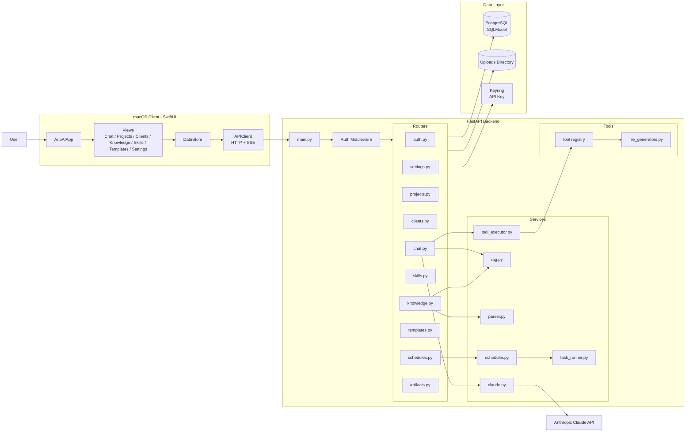
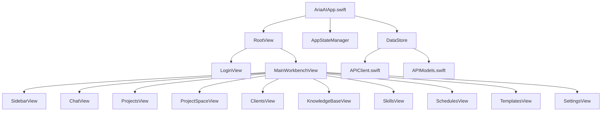
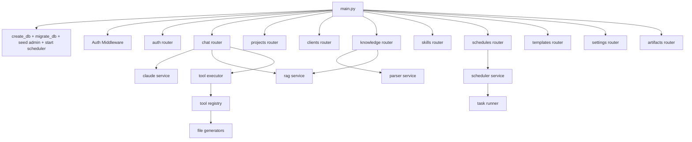
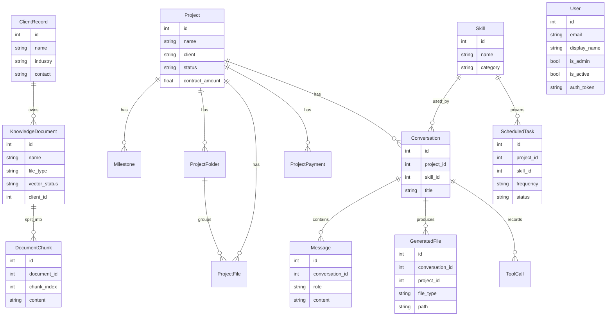
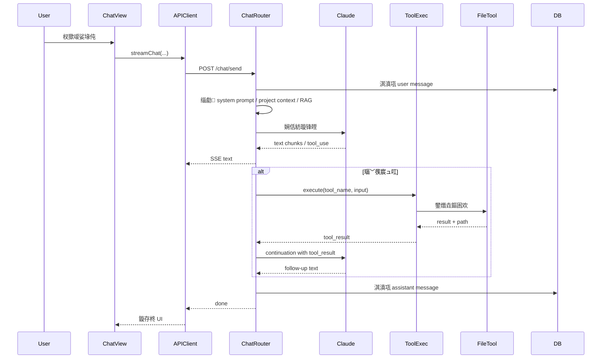
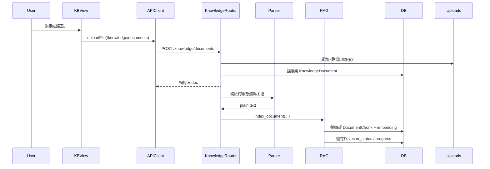
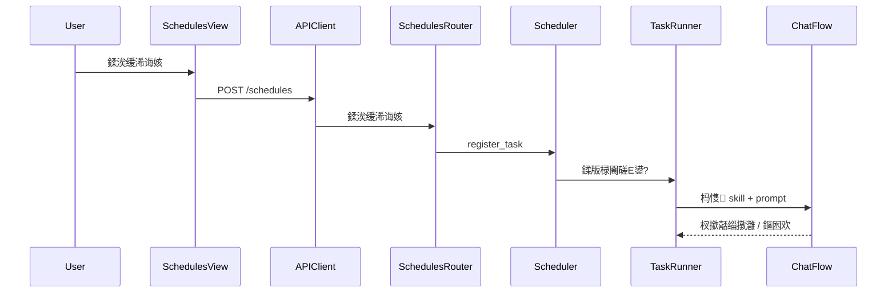

# AriaAI 褰撳墠鏋舵瀯鍥?

> 鏃ユ湡锛?026-03-26  
> 璇存槑锛氭湰鍥惧熀浜庡綋鍓嶄粨搴撳疄闄呬唬鐮佺粨鏋勬暣鐞嗭紝鍙嶆槧鐨勬槸鈥滅幇鍦ㄧ殑绯荤粺鈥濓紝涓嶆槸鏈潵鐩爣鏋舵瀯銆?

---

## 1. 鎬昏鍥?

---

## 2. 鍓嶇缁撴瀯鍥?

---

## 3. 鍚庣缁撴瀯鍥?

---

## 4. 鏁版嵁妯″瀷鍏崇郴鍥?

---

## 5. 鍏抽敭閾捐矾鍥?

## 5.1 鑱婂ぉ涓庡伐鍏疯皟鐢ㄩ摼璺?

---

## 5.2 鐭ヨ瘑搴撲笂浼犱笌绱㈠紩閾捐矾

---

## 5.3 瀹氭椂浠诲姟閾捐矾

---

## 6. 褰撳墠鏋舵瀯鐗圭偣

### 浼樼偣

- 鍓嶅悗绔亴璐ｅぇ鑷存竻鏅?
- 宸茬粡鍏峰瀹屾暣鐨勪笟鍔￠鏋?
- 鑱婂ぉ銆佺煡璇嗗簱銆佹妧鑳姐€侀」鐩€佷氦浠樼墿鍩烘湰涓茶捣鏉ヤ簡
- 鏁版嵁妯″瀷宸茬粡瑕嗙洊浜嗗疄闄呬笟鍔″璞?

### 褰撳墠鐡堕

- 鑱婂ぉ璺敱鎵挎媴鑱岃矗杩囧
- RAG 浠嶅亸杞婚噺瀹炵幇
- 宸ュ叿鎵ц涓庝氦浠樼墿鐢熸垚鑰﹀悎杈冩繁
- 寮傛浠诲姟鐘舵€佽繕涓嶅缁熶竴
- 鐜版灦鏋勬洿鍍忓崟浣撳簲鐢紝鍚庣画鎵╁睍浼氶潰涓磋竟鐣屽垝鍒嗗帇鍔?

---

## 7. 鍚庣画婕旇繘寤鸿

濡傛灉鍚庨潰瑕佷粠褰撳墠鏋舵瀯缁х画婕旇繘锛屽缓璁紭鍏堝線杩欏嚑涓柟鍚戞媶锛?

- `context builder`
- `retrieval service`
- `generation service`
- `task state / background jobs`

杩欏嚑涓媶鍑烘潵涔嬪悗锛屽綋鍓嶆灦鏋勪細鏇村鏄撳線锛?

- Vercel 杞?API + 澶栭儴 worker
- 涓诲悗绔?+ AI 瀛愭湇鍔?
- 鍗曚綋鍒版ā鍧楀寲鍗曚綋

杩欐牱鐨勮矾绾跨户缁紨杩涖€?

