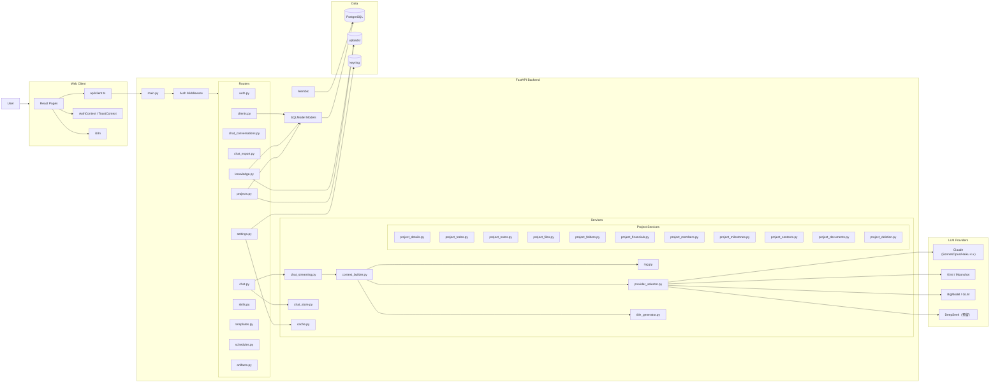

# AriaAI 当前架构图

更新日期：2026-04-16

这份文档描述的是当前代码已经落地的结构，不是理想蓝图。

## 1. 系统总览

## 2. 前端结构

### 2.1 页面层

- `src/App.tsx`（路由入口）
- `src/pages/Welcome.tsx`
- `src/pages/chat/Chat.tsx`
- `src/pages/projects/Projects.tsx`
- `src/pages/projects/NewProject.tsx`
- `src/pages/projects/ProjectDetail.tsx`（路由壳 + 共享状态，~125 行）
- `src/pages/projects/ProjectDetailLayout.tsx`（Header + Tab 导航 + 持久化 Tab 渲染）
- `src/pages/projects/useProjectDetailData.ts`（数据拉取 Hook）
- `src/pages/projects/ProjectOverviewTab.tsx`
- `src/pages/projects/ProjectNotesTab.tsx`
- `src/pages/projects/ProjectTodosTab.tsx`
- `src/pages/projects/ProjectChatTab.tsx`
- `src/pages/projects/ProjectDocumentsTab.tsx`
- `src/pages/projects/ProjectMilestonesTab.tsx`
- `src/pages/projects/ProjectFinancialsTab.tsx`
- `src/pages/projects/ProjectSettingsTab.tsx`
- `src/pages/projects/ProjectUserPicker.tsx`（共享用户选择器组件）
- `src/pages/clients/*`
- `src/pages/knowledge/*`
- `src/pages/settings/*`

### 2.2 当前特点

- 项目空间已经成为最核心的交互中心
- `ProjectDetail.tsx` 已完成清理：仅剩路由装配 + `useProjectDetailData` 调用，约 125 行
- `ProjectDetailLayout.tsx` 承接 Header、Tab 导航（NavLink + React Router）和 Chat/Notes/Todos 三个持久化 Tab 的显示/隐藏逻辑
- Chat、Notes、Todos 三个 Tab 通过 `hidden` class 而非卸载实现持久化，保留状态与会话连接
- 其他 Tab（Overview / Documents / Milestones / Financials / Settings）通过 React Router `<Routes>` 按需渲染
- `ProjectUserPicker.tsx` 已从 `ProjectTodosTab.tsx` 抽离为共享组件

## 3. 后端结构

### 3.1 Router 分层

- `auth.py`：登录、用户、token
- `chat.py`：聊天主入口
- `chat_conversations.py`：会话列表与详情
- `chat_export.py`：聊天导出
- `clients.py`：客户管理
- `knowledge.py`：知识库与检索
- `projects.py`：项目域核心逻辑
- `settings.py` / `skills.py` / `templates.py` / `schedules.py` / `artifacts.py`

### 3.2 Service 分层

**聊天域：**
- `chat_streaming.py`：SSE 流式回复，组装 `ChatRuntime`
- `chat_store.py`：会话与消息持久化
- `context_builder.py`：上下文组装（project / client / global scope）
- `rag.py`：知识检索与排序
- `provider_selector.py`：LLM provider 选择（claude / kimi / bigmodel / deepseek）
- `title_generator.py`：对话标题生成
- `tool_executor.py`：function calling 工具执行

**项目域（已按子模块完全拆分）：**
- `project_details.py`：项目详情聚合，组装 `build_project_detail()`
- `project_todos.py`：待办 CRUD + 序列化 + 跨项目查询
- `project_notes.py`：项目笔记保存
- `project_files.py`：文件上传、下载、删除
- `project_folders.py`：文件夹列表、创建、删除
- `project_financials.py`：财务记录 CRUD + 汇总计算
- `project_members.py`：项目成员增删查 + 序列化
- `project_milestones.py`：里程碑 CRUD
- `project_contexts.py`：项目上下文数据拼装 + 摘要写回
- `project_documents.py`：Markdown 文档命名、写盘、导出
- `project_deletion.py`：项目级联删除编排

### 3.3 当前特点

- 聊天域已经做过一轮模块化拆分
- 项目域已完成 11 个独立子 service 的拆分，`projects.py` 仅保留接口层路由和少量调度编排
- 上下文策略已经从”全局召回优先”转向”项目隔离优先”
- `provider_selector.py` 统一管理 LLM provider 切换，新增 DeepSeek keychain 预留

## 4. 数据层

### 4.1 核心表

- `project`
- `projectfile`
- `projectfolder`
- `projecttodo`
- `projectmember`
- `projectpayment`
- `milestone`
- `conversation`
- `message`
- `toolcall`（function calling 历史记录）
- `generatedfile`（AI 生成文件记录）
- `knowledgedocument`
- `documentchunk`
- `skill`
- `scheduledtask`
- `template`
- `clientrecord`
- `user`
- `usertoken`
- `setting`

### 4.2 当前数据库策略

- PostgreSQL 是默认数据库
- Alembic 是正式迁移路径
- SQLite 仅作为显式 fallback，不再是推荐默认方案

### 4.3 当前迁移注意事项

- 代码更新后要显式执行 `alembic upgrade head`
- 当前迁移版本至少包括：
  - `003_v1_3_project_members`
  - `004_v1_4_knowledge_doc_project_id`
  - `005_v1_5_todo_due_date`
- 线上曾出现结构已存在但 Alembic 版本落后的情况，部署流程需要更强约束

## 5. 最近新增或变化明显的能力

### 2026-04-15

- 咨询类售前项目文档模板
- 项目 Markdown 文档工作区
- 项目文档 AI 润色流式输出
- 项目待办截止日期
- 仪表盘”我的待办”显示日期
- `KnowledgeDocument.project_id`
- 项目聊天知识范围切换与隔离

### 2026-04-16

- `ProjectDetail.tsx` 完成死代码清理，缩减为纯路由壳（~125 行）
- 项目域后端 11 个子 service 拆分完成
- `ToolCall` 与 `GeneratedFile` 数据库模型上线
- `Skill.tools_definition_json` 支持 Claude 标准 tools 格式
- DeepSeek API key 预留
- 售前模板乱码修复
- 项目对话快捷提示中文文案修复

## 6. 当前主要风险

- `projects.py` router 层仍有部分路由的业务逻辑可继续向 service 层下沉
- 迁移状态与真实数据库结构一致性仍需加强（历史上出现过列已存在但迁移仍尝试新增的情况）
- 安全项未完成：API Key 未加密存储、认证无限流
- 自动化测试对项目域覆盖持续提升中，但仍不完整

## 7. 后续建议

1. 继续收缩 `projects.py` 中与接口无关的数据库直查逻辑，全部下沉到对应 project service。
2. 加固 Alembic 迁移幂等性，部署流加入迁移失败中断与数据库健康检查。
3. 推进安全项：API Key 加密存储、登录限流、文件路径边界校验。
4. 继续扩展项目域回归测试覆盖。
