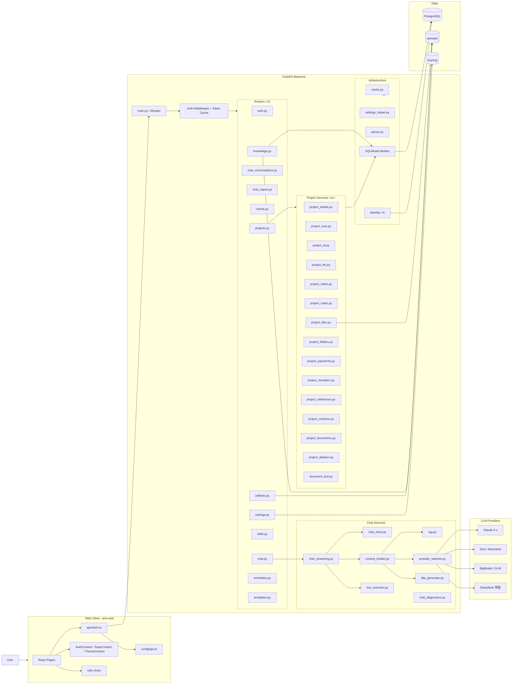

# AriaAI 当前架构图

更新日期：2026-04-16（第二轮）

这份文档描述的是当前代码已经落地的结构，不是理想蓝图。

## 1. 系统总览



## 2. 前端结构

### 2.1 页面层（Pages）

```
src/pages/
├── Welcome.tsx              # 仪表盘：活跃项目 / 近期对话 / 我的待办 / 财务概览
├── Login.tsx
├── chat/
│   └── Chat.tsx             # 全局聊天（支持 Skill 模式）
├── projects/
│   ├── Projects.tsx         # 项目列表 + 新建入口
│   ├── NewProject.tsx
│   ├── ProjectDetail.tsx    # 路由壳 ~125 行（useProjectDetailData + ProjectDetailLayout + Routes）
│   ├── ProjectDetailLayout.tsx  # Header + Tab 导航 + 持久化 Tab 渲染
│   ├── useProjectDetailData.ts  # 数据拉取 Hook
│   ├── ProjectOverviewTab.tsx
│   ├── ProjectChatTab.tsx   # 项目聊天（内部已深度拆分，见 2.2）
│   ├── ProjectNotesTab.tsx  # 项目笔记（内部已深度拆分，见 2.3）
│   ├── ProjectTodosTab.tsx
│   ├── ProjectDocumentsTab.tsx
│   ├── ProjectMilestonesTab.tsx
│   ├── ProjectFinancialsTab.tsx
│   ├── ProjectSettingsTab.tsx
│   └── ProjectUserPicker.tsx   # 共享用户选择器
├── clients/
│   ├── Clients.tsx
│   └── ClientDetail.tsx
├── knowledge/
│   └── Knowledge.tsx
├── skills/
│   └── Skills.tsx
├── conversations/
│   └── Conversations.tsx
└── settings/
    ├── SettingsLayout.tsx
    ├── ProfileSettings.tsx
    ├── AISettings.tsx          # LLM provider / model / API key
    ├── UsersSettings.tsx       # 用户管理（admin only）
    ├── ServerSettings.tsx      # API 服务器地址
    ├── LanguageSettings.tsx
    └── AboutSettings.tsx
```

### 2.2 ProjectChatTab 内部结构（已深度拆分）

```
ProjectChatTab.tsx
├── ProjectChatSidebar          # 会话列表侧边栏
├── ProjectChatHeader           # 对话标题 + 导出按钮
├── ProjectChatMessagePane      # 消息列表
├── ProjectChatInput            # 输入框 + 快捷提示
├── useProjectChatConversation  # 会话加载 / 切换 / 创建 Hook
├── useProjectChatComposer      # 发送消息 / SSE 流式 Hook
└── useProjectChatExport        # 导出下拉菜单 Hook
```

### 2.3 ProjectNotesTab 内部结构（已深度拆分）

```
ProjectNotesTab.tsx
├── ProjectNotesLayout          # 文档树 + 编辑器分栏布局
├── ProjectNotesDocumentDialogs # 新建 / 重命名 / 删除弹窗
├── ProjectNotesAIModal         # AI 润色弹窗
├── useProjectNotesDocument     # 当前文档状态 Hook
├── useProjectNotesActions      # 文档操作（CRUD）Hook
├── useProjectNotesAI           # AI 润色流式 Hook
└── useProjectNotesDocumentActions  # 更多操作菜单 Hook
```

### 2.4 Tab 渲染策略

| Tab | 渲染方式 | 原因 |
|-----|---------|------|
| Chat | 持久化（`hidden` class 保活） | SSE 连接 + 会话状态不可丢失 |
| Notes | 持久化 | 编辑器状态 + 文档树展开状态 |
| Todos | 持久化 | 表单草稿状态 |
| Overview / Documents / Milestones / Financials / Settings | React Router 按需渲染 | 无强状态需求 |

懒加载（`lazy mount`）：面板初次进入 Tab 时才挂载，避免首屏开销。

### 2.5 共享基础设施

- `api/client.ts`：Axios 封装（X-Auth-Token 注入 + 401 重定向）
- `config/api.ts`：三源 API URL 解析（localStorage → VITE_API_URL → 默认）
- `contexts/AuthContext.tsx`：登录态 + 当前用户信息
- `contexts/ToastContext.tsx`：全局通知
- `contexts/ThemeContext.tsx`：暗/亮模式
- `i18n/index.ts`：zh-CN / en-US 双语，localStorage 持久化
- `types/api.ts`：全量类型定义

## 3. 后端结构

### 3.1 Router 层（11 个）

| Router | 职责 |
|--------|------|
| `auth.py` | 登录、用户 CRUD（admin）、多设备 Token |
| `chat.py` | SSE 流式聊天、会话 CRUD、连通性测试 |
| `chat_conversations.py` | 会话列表与消息分页 |
| `chat_export.py` | 对话导出 Markdown / PDF |
| `projects.py` | 项目域所有接口（路由层），业务下沉到 service |
| `knowledge.py` | 知识库文档上传 / 向量化 / 检索 |
| `clients.py` | 客户 CRUD + AI 建议 |
| `settings.py` | API Key 管理 + 三层配置读写 |
| `skills.py` | Skill CRUD + 工具 schema + 连通性测试 |
| `artifacts.py` | 生成文件列表 / 下载 |
| `schedules.py` | 调度任务 CRUD + 手动触发 |
| `templates.py` | 文档模板管理 |

### 3.2 Service 层

**聊天域：**

| Service | 职责 |
|---------|------|
| `chat_streaming.py` | SSE 流式回复，组装 `ChatRuntime`，工具调用编排 |
| `chat_store.py` | 会话 / 消息持久化，分页查询，缓存 |
| `chat_diagnostics.py` | API provider 连通性测试，模型验证 |
| `context_builder.py` | 上下文组装（project / client / global scope），文件内容注入 |
| `rag.py` | 向量检索，相似度排序，文档块召回 |
| `provider_selector.py` | LLM provider 路由（claude / kimi / bigmodel / deepseek） |
| `title_generator.py` | 对话标题生成（异步后台） |
| `tool_executor.py` | function calling 工具执行与格式化 |

**项目域（已完成全量拆分，15 个模块）：**

| Service | 职责 |
|---------|------|
| `project_core.py` | 项目基础 CRUD 操作 |
| `project_details.py` | 详情聚合：`build_project_detail()` |
| `project_ai.py` | AI 建议提示词、文件摘要生成 |
| `project_llm.py` | 项目聊天模型选择 |
| `project_contexts.py` | 项目上下文数据拼装 + 摘要写回 |
| `project_documents.py` | Markdown 文档命名、写盘、merge 导出 |
| `project_files.py` | 文件上传、下载、删除 |
| `project_folders.py` | 文件夹 CRUD |
| `project_payments.py` | 财务记录 CRUD + 汇总（含 invoiced 类型） |
| `project_members.py` | 项目成员增删查 |
| `project_milestones.py` | 里程碑 CRUD |
| `project_notes.py` | 项目笔记保存 + AI 润色 |
| `project_todos.py` | 待办 CRUD + 跨项目聚合 + 序列化 |
| `project_deletion.py` | 项目级联删除编排 |
| `document_text.py` | 多格式文档文本提取（PDF / DOCX / PPTX / XLSX / TXT / MD） |

**基础设施：**

| Service | 职责 |
|---------|------|
| `cache.py` | TTLCache（projects 120s / conversations 20s / settings 300s） |
| `settings_helper.py` | 三层配置体系读取 |
| `parser.py` | 文档解析（知识库上传） |
| `scheduler.py` | APScheduler 任务管理 |
| `task_runner.py` | 后台任务执行 |

### 3.3 特点

- **接口层薄**：`projects.py` 路由层只做输入校验和响应格式化，所有业务逻辑通过 service 调用
- **上下文策略**：project scope → 当前项目文件 + 摘要；client scope → 同客户知识库；global scope → 全局知识库
- **工具调用**：`Skill.tools_definition_json` 存储 Claude 标准格式，`tool_executor.py` 负责执行，`ToolCall` 记录历史

## 4. 数据层

### 4.1 核心表（完整列表）

| 表名 | 说明 |
|------|------|
| `user` | 用户（admin / active / password_hash） |
| `usertoken` | 多设备 Token（一设备一 Token） |
| `project` | 项目主表（状态 / 合同金额 / 上下文摘要 / md_notes） |
| `projectfile` | 项目上传文件（AI 摘要 + 文件夹归属） |
| `projectfolder` | 项目文件夹 |
| `projecttodo` | 待办（指派用户 / 截止日期） |
| `projectmember` | 项目成员 |
| `projectpayment` | 财务记录（received / expense / milestone_payment / invoiced） |
| `milestone` | 项目里程碑 |
| `conversation` | 会话（可挂载 project / skill） |
| `message` | 消息（metadata_json 存 RAG 引用 / 工具 ID） |
| `toolcall` | function calling 历史（工具名 / 输入 / 输出 / 状态） |
| `generatedfile` | AI 生成文件（PPT / Word / PDF / MD 等） |
| `knowledgedocument` | 知识库文档（client_id / project_id 双维归属） |
| `documentchunk` | 向量化文档块（embedding_json） |
| `skill` | Skill 模板（tools_definition_json 支持 Claude 标准格式） |
| `scheduledtask` | 调度任务 |
| `template` | 文档模板（PPTX / DOCX / PDF） |
| `clientrecord` | 客户 |
| `setting` | 键值对配置 |

### 4.2 数据库策略

- PostgreSQL 是默认数据库（`DEFAULT_POSTGRES_URL = postgresql://...`）
- SQLite 仅作为本地开发显式 fallback（`DATABASE_URL` 可覆盖）
- Alembic 是正式迁移路径，当前最新：`005_v1_5_todo_due_date`
- 启动时自动执行 `_fix_pg_sequences()`，防止 sequence 漂移导致主键冲突
- 启动时执行 `_backfill_folders()`，为历史项目补建默认文件夹

### 4.3 三层配置体系（Settings）

```
优先级：DB runtime > 代码默认 > 环境变量

典型 key：
llm_provider, claude_model, max_tokens, temperature
api_key（加密存 keyring）
```

## 5. API 接口速查

### 项目域关键接口

```
GET    /projects                           # 列表（含 status/member 筛选，缓存）
POST   /projects                           # 创建
GET    /projects/{id}/detail               # 聚合详情（单次查询）
PATCH  /projects/{id}                      # 更新
DELETE /projects/{id}                      # 级联删除
POST   /projects/{id}/notes/ai-polish-stream  # AI 润色（SSE）
POST   /projects/{id}/generate-context     # AI 上下文摘要（SSE）
POST   /projects/{id}/conversations/{conv_id}/save-markdown  # 沉淀为文档
GET    /projects/todos/my                  # 跨项目我的待办
```

### 聊天域关键接口

```
POST   /chat/send                          # SSE 流式（支持 knowledge_scope / rag_doc_ids / file_ids）
POST   /chat/test-connection               # API provider 连通性测试
POST   /chat/test-model                    # 模型可用性测试
```

### 生成物接口

```
GET    /artifacts                          # 列出生成文件（按 conversation/project 筛选）
GET    /artifacts/{id}/download            # 下载（安全路径边界）
DELETE /artifacts/{id}                     # 删除
```

## 6. 当前主要风险与待解事项

1. **生成物前端接入未完成**：`GeneratedFile` / `artifacts` 路由已落地，但前端没有统一的生成物视图
2. **工具调用过程无前端可视化**：`ToolCall` 数据已持久化，但聊天界面没有"AI 正在调用工具..."的状态提示
3. **RAG 引用展示薄弱**：`references` SSE event 有数据，前端展示不够显眼
4. **Alembic 迁移幂等性**：历史上出现过列已存在但迁移仍报错的情况，未做全面加固
5. **安全项未完成**：API Key 明文（keyring）、无认证限流、文件路径边界已有基础实现但不完整
6. **Skills 与项目空间联动弱**：15 个专业 Skill 已落地，但从项目直接调用 Skill 的交互路径不顺

## 7. 后续建议

1. **生成物管理前端**：接入 `/artifacts`，在项目页建立生成物视图（文件卡片 + 下载）
2. **引用来源展示**：消费聊天的 `references` event，在回答底部展示来源文档名
3. **工具调用可视化**：聊天流中增加工具调用状态提示气泡
4. **Alembic 幂等加固**：迁移脚本加 `IF NOT EXISTS` 保护，部署流加健康检查
5. **Skill 与项目绑定**：项目聊天页支持选 Skill 作为对话模式入口
