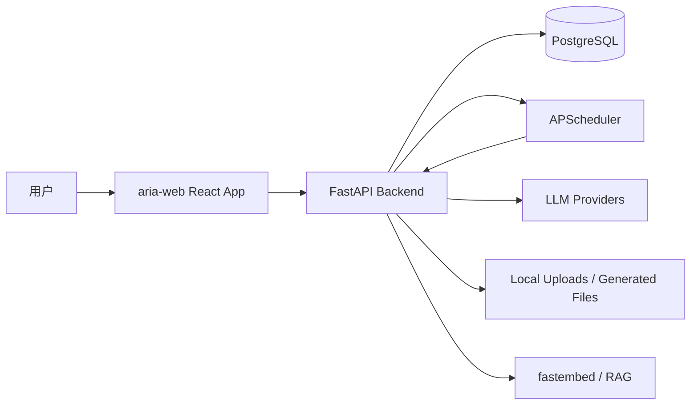
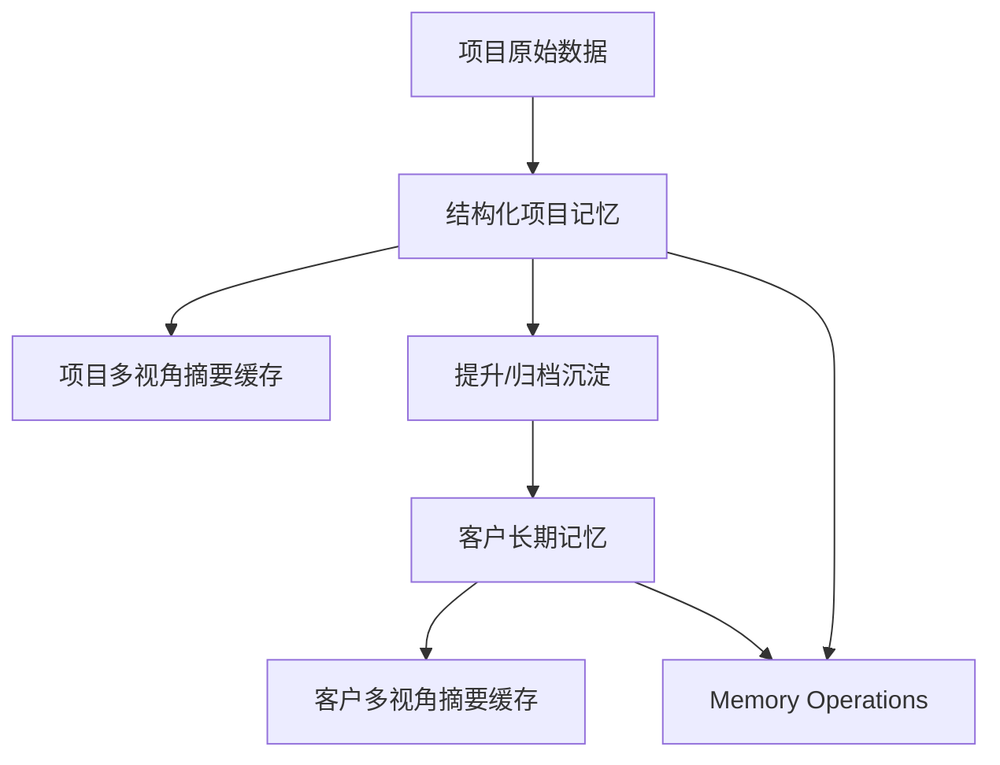

# 当前架构图

更新时间：2026-04-20

## 1. 总体架构



## 2. 前端结构

```text
aria-web/src/
├── api/
├── components/
├── config/
├── contexts/
├── pages/
│   ├── clients/
│   ├── projects/
│   ├── settings/
│   └── skills/
├── routeLoaders.ts
└── types/
```

关键页面：

- `pages/projects/ProjectDetail.tsx`：项目详情路由壳。
- `pages/projects/ProjectDetailLayout.tsx`：项目详情布局与 Tab。
- `pages/projects/ProjectMemoryTab.tsx`：项目记忆页，支持提升到客户记忆。
- `pages/clients/ClientMemoryPage.tsx`：客户记忆页。
- `pages/settings/MemoryOperationsSettings.tsx`：统一任务面板。
- `pages/settings/MigrationSettings.tsx`：迁移状态页。
- `pages/skills/Skills.tsx`：Skill 管理页。

## 3. 后端结构

```text
AriaAI/backend/
├── app/
│   ├── routers/
│   ├── services/
│   ├── models/
│   ├── database.py
│   └── config.py
├── alembic/
│   └── versions/
├── scripts/
│   ├── ensure_db.py
│   └── migration_governance.py
├── tests/
└── POSTGRESQL.md
```

关键路由：

| 文件 | 责任 |
|---|---|
| `routers/projects.py` | 项目、项目记忆、项目任务、项目摘要 |
| `routers/clients.py` | 客户、客户记忆、客户任务、客户摘要 |
| `routers/skills.py` | Skill CRUD |
| `routers/health.py` | 健康检查与迁移状态 |
| `routers/chat.py` | 全局聊天 |
| `routers/project_chat.py` | 项目聊天 |
| `routers/auth.py` | 登录、用户、Token |

关键服务：

| 文件 | 责任 |
|---|---|
| `services/project_contexts.py` | 项目上下文、项目记忆、摘要缓存 |
| `services/client_contexts.py` | 客户记忆、客户摘要 |
| `services/scheduler_service.py` | 后台任务调度 |
| `services/chat_streaming.py` | 流式聊天编排 |
| `services/project_documents.py` | 项目文档保存与合并 |

## 4. 数据与迁移

当前迁移链：

- `001_v1_1`
- `002_v1_2`
- `003_v1_3`
- `004_v1_4`
- `005_v1_5`

迁移治理能力：

- `scripts/migration_governance.py report`
- `scripts/migration_governance.py json`
- `scripts/migration_governance.py check`
- `scripts/migration_governance.py ensure`
- `scripts/migration_governance.py upgrade`
- `scripts/migration_governance.py current`

特殊治理：

- 支持历史短号 alias 修复，例如 `005` -> `005_v1_5`。
- `ensure_db.py` 只做幂等补齐，不会把非空 revision 盲目 stamp 到 head。
- 部署脚本已经接入 `report -> ensure -> upgrade -> check`。

## 5. 记忆系统架构



项目记忆存储：

- `Project.context_memory_json`
- `Project.memory_version`
- `Project.memory_stale`
- `Project.memory_rebuild_status`
- `Project.memory_rebuild_failed_at`

客户记忆存储：

- `ClientRecord.client_memory_json`
- `ClientRecord.client_memory_version`
- `ClientRecord.client_memory_stale`
- `ClientRecord.client_memory_rebuild_status`
- `ClientRecord.client_memory_rebuild_failed_at`

任务治理：

- 项目/客户任务统一展示。
- 失败分类与失败明细。
- 重试与取消。
- 预算与告警汇总。

## 6. 当前状态表

| 能力 | 状态 | 备注 |
|---|---|---|
| 项目工作台 | 已完成 V1 | 后续继续体验优化 |
| 项目聊天 | 已完成 V1 | 支持引用、工具、生成物、Skill 表达 |
| 项目记忆 | 已完成 V1 | 后续做历史版本 |
| 客户记忆 | 已完成 V1 | 后续做更多业务入口 |
| 统一任务面板 | 已完成 V2 | 后续做服务端统计与批量治理 |
| Alembic 迁移治理 | 已完成基础闭环 | 已接入部署脚本和设置页 |
| Skill 与项目/客户联动 | 部分完成 | 下一版本 P0 |
| Welcome 今日感 | 待强化 | 下一版本 P1 |
| Markdown/XSS 复核 | 待系统化 | 下一版本 P1 |
| 性能与复杂度治理 | 持续推进 | 项目/客户列表和大组件拆分 |

## 7. 下一架构演进

1. Skill 工作流化：项目/客户空间直接启动 Skill。
2. 记忆版本化：引入 `memory_snapshot` 或等价表。
3. 任务治理服务端化：聚合统计、批量处理、告警策略。
4. 工作台行动化：Welcome 和 Overview 从展示变成行动入口。
5. 质量基线：测试分层、Markdown 安全、迁移 PR 规范。
