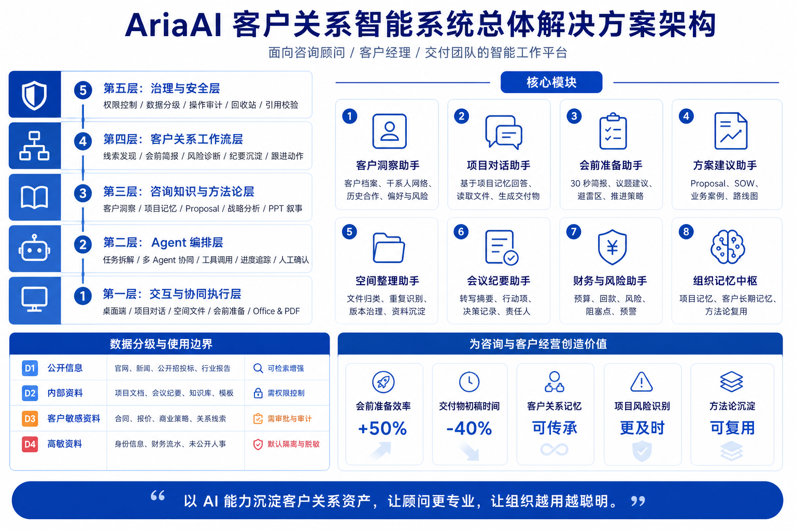
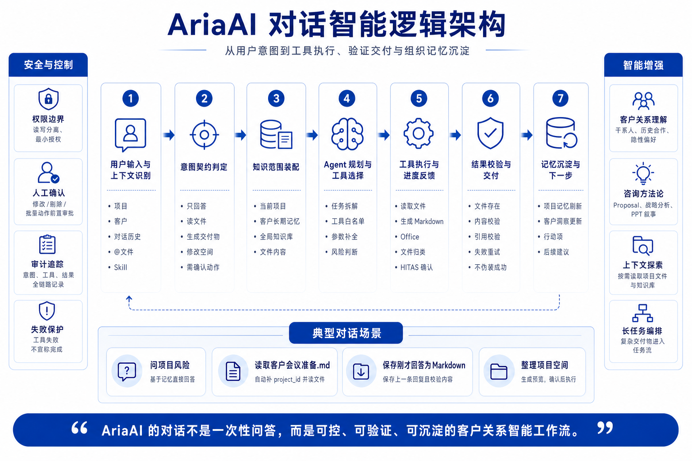

# AriaAI 架构与对话逻辑图

本文档用于沉淀 AriaAI 的产品架构表达，可用于内部汇报、客户沟通和产品路线说明。

## 1. AriaAI 客户关系智能系统总体解决方案架构

这张图借鉴了企业解决方案架构图的表达方式，但内容已调整为 AriaAI 的定位：以客户关系、项目记忆、咨询方法论和可控工具执行为核心，形成面向咨询顾问、客户经理和交付团队的智能工作平台。

核心表达重点：

- 左侧用五层架构说明产品能力底座：交互协同、Agent 编排、咨询知识、客户关系工作流、治理安全。
- 右侧用核心模块说明用户可感知能力：客户洞察、项目对话、会前准备、方案建议、空间整理、会议纪要、财务风险、组织记忆。
- 底部补充数据分级和业务价值，强调 AriaAI 不是通用聊天工具，而是客户关系资产和组织方法论的沉淀系统。

## 2. AriaAI 对话智能逻辑架构

这张图用于解释 AriaAI 对话功能的运行逻辑：从用户输入开始，经过意图契约、知识范围、Agent 规划、工具执行、结果校验，最后沉淀到项目记忆和客户长期记忆。

核心表达重点：

- 对话不是一次性问答，而是一条可控、可验证、可沉淀的工作流。
- 系统需要先判断用户到底是在“问问题”“读文件”“生成交付物”“修改项目空间”还是“执行高风险动作”。
- 工具执行必须带有项目边界、权限边界和结果校验，不能出现“工具失败但回复说完成”的情况。
- 复杂动作进入 HITAS 或任务编排，保证顾问仍然掌握最终控制权。

## 3. 可借鉴的表达方式

原参考图值得借鉴的是信息组织方式：

- 用分层架构解释底层能力。
- 用模块矩阵解释产品功能。
- 用数据分级解释安全边界。
- 用业务价值解释为什么值得落地。

AriaAI 的表达重点不应放在“像某个通用 Agent”，而应放在：

- 客户关系资产沉淀。
- 咨询方法论复用。
- 会前 30 秒决策支持。
- 项目空间与交付物治理。
- Human-in-the-Loop 的受控自动化。

