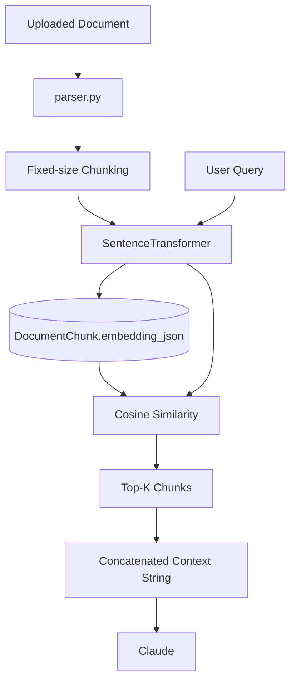
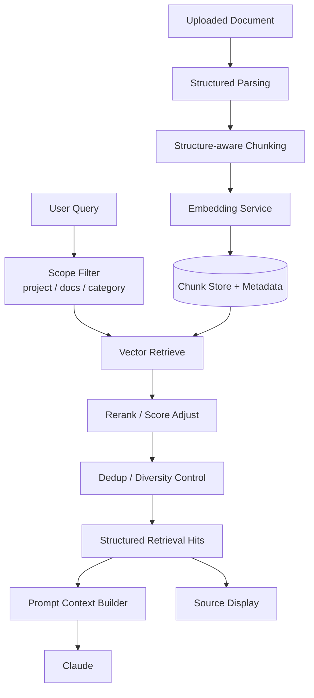

# AriaAI RAG 演进方案

> 日期：2026-03-26  
> 目的：说明当前 RAG 为什么属于轻量实现，以及下一阶段如何演进到更稳的生产级方案

---

## 1. 一句话结论

当前 RAG 已经完成了：

> **从 0 到 1 的可用实现**

但还没有完成：

> **从“能检索”到“稳定、高质量、可解释地支持真实项目交付”**

所以这里说“RAG 仍偏轻量实现”，意思不是它没价值，而是它现在更像一个清晰、简洁、可运行的 baseline。

---

## 2. 当前 RAG 的实际实现

基于现有代码，当前核心路径大致是：

```text
上传文档
-> 解析文本
-> 按固定 chunk_size / overlap 切块
-> sentence-transformers 生成 embedding
-> 存入 DocumentChunk.embedding_json
-> 查询时对所有 chunk 做 cosine similarity
-> 取 top-k
-> 拼接为字符串注入 prompt
```

当前关键实现文件：

- `AriaAI/backend/app/services/rag.py`
- `AriaAI/backend/app/routers/knowledge.py`
- `AriaAI/backend/app/services/parser.py`

当前配置：

- `CHUNK_SIZE = 800`
- `CHUNK_OVERLAP = 100`
- `TOP_K_RESULTS = 5`
- `EMBEDDING_MODEL = "all-MiniLM-L6-v2"`

---

## 3. 为什么说它“偏轻量”

## 3.1 检索流程是标准 baseline，而不是增强版检索

当前实现本质上是：

- 向量化
- 余弦相似度
- top-k 返回

这是最典型的第一阶段 RAG 实现。

优点：

- 简单
- 稳定
- 容易理解
- 成本低

限制：

- 对复杂场景区分能力不够
- 对高质量召回缺少进一步筛选

---

## 3.2 没有 rerank 层

当前流程中，embedding 相似度高的 chunk 会直接进入结果。

但在真实业务场景里：

- 语义相近，不等于真正相关
- 真正相关，不等于最值得放进 prompt
- 多个候选块之间，常常需要二次排序

当前没有额外的重排逻辑，因此召回质量会依赖 embedding baseline 本身。

这就是轻量实现的一个典型特征。

---

## 3.3 chunk 策略偏朴素

当前分块方式是固定长度分块。

这种方式的问题在复杂文档里会很明显：

- 标题和正文可能被拆开
- 表格和说明可能被截断
- 段落语义边界不被尊重
- PDF 页结构没有被充分利用

对于咨询类文档，这种问题尤其明显，因为这类文档经常有：

- 页标题
- 小结
- 图表说明
- 表格
- 多级结构

如果 chunk 不理解结构，只按长度切，很容易“切得技术上对，语义上不对”。

---

## 3.4 结果返回还是字符串导向

当前 `retrieve()` 返回的是拼接后的文本。

这说明当前 RAG 更像是：

> 给 LLM 塞参考材料

而不是：

> 返回结构化检索结果，供系统进一步加工和展示

这会限制后续能力，比如：

- 显示引用来源
- 命中结果评分可视化
- 前端展示“来自哪一份文档”
- 后端分析“为什么命中这几段”

---

## 3.5 缺少质量控制策略

成熟一些的 RAG 通常会考虑：

- 最低相似度阈值
- 去重
- 同文档过多结果抑制
- 项目文档优先
- 最近文档优先
- 文档类型差异处理

当前实现没有这类明显的控制层，所以更像“召回了就给模型”。

---

## 3.6 缺少检索可观测性

当前系统还不太容易回答这些问题：

- 哪些文档最常被命中
- 哪些查询经常召回失败
- 哪些 chunk 总被误命中
- 模型最终用了哪些引用

这意味着后续优化会更多依赖体感，而不是数据反馈。

---

## 4. 当前架构图



---

## 5. 下一阶段增强版 RAG 应该长什么样

## 5.1 目标

下一阶段不是推翻，而是增强。

目标是把当前 RAG 升级成：

- 更稳定
- 更可解释
- 更适合项目场景
- 更容易调优

---

## 5.2 建议的增强结构



---

## 6. 建议分三步演进

## 第一步：结构化返回

### 目标

不再只返回拼接字符串，而是返回结构化结果。

### 建议输出结构

```json
[
  {
    "document_id": 12,
    "document_name": "某客户项目背景资料.pdf",
    "chunk_index": 3,
    "score": 0.82,
    "content": "命中的文本片段"
  }
]
```

### 为什么先做这个

这是后续一切增强的基础：

- 前端引用展示
- 日志分析
- rerank
- 去重
- prompt 组装策略

---

## 第二步：增强召回质量

### 目标

让“召回相关”变成“召回有用”。

### 建议补充

- score threshold
- 同文档命中数限制
- 多文档平衡
- 项目文档优先
- category filter
- doc_ids filter 强化

### 进一步增强

- 轻量 rerank
- 基于 query + chunk 的二次打分

---

## 第三步：结构感知切块

### 目标

让 chunk 更贴近文档语义，而不是只贴近长度。

### 建议方向

- 按标题切块
- 按段落切块
- 表格单独处理
- PDF 页面结构保留
- 大段落再做二次切块

### 这一步的价值

它会直接提升：

- 检索质量
- 引用可读性
- LLM 使用上下文的效果

---

## 7. 建议新增的数据结构

后续可以考虑增加：

- `RetrievalHit`
- `DocumentSection`
- `ConversationRetrievalLog`
- `ProjectKnowledgeScope`

不一定要一开始就落库，但建议在代码结构上提前留接口。

---

## 8. 对当前项目最现实的短期建议

如果只做最划算的几件事，我建议按这个顺序：

1. `retrieve()` 返回结构化结果
2. 增加 score 阈值和基础去重
3. 在聊天链路中显示引用来源
4. 为项目 / 文档范围控制留标准接口
5. 再考虑 rerank 和结构感知切块

---

## 9. 一句话理解“轻量实现”

如果要最直白地解释：

> 当前 RAG 已经能工作，但它更像“向量检索 baseline + prompt 注入”，还不是“面向复杂项目场景的成熟检索系统”。

这就是“RAG 仍偏轻量实现”的真正含义。
