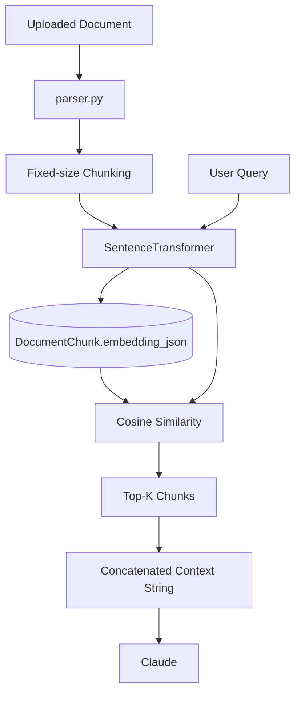
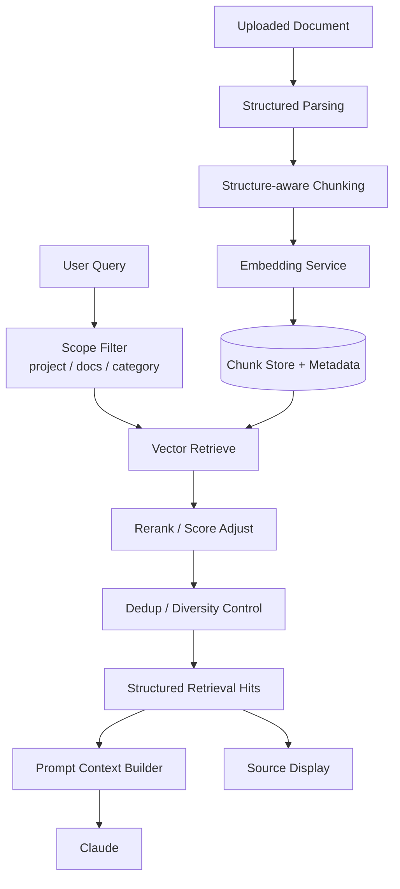

# AriaAI RAG 婕旇繘鏂规

> 鏃ユ湡锛?026-03-26  
> 鐩殑锛氳鏄庡綋鍓?RAG 涓轰粈涔堝睘浜庤交閲忓疄鐜帮紝浠ュ強涓嬩竴闃舵濡備綍婕旇繘鍒版洿绋崇殑鐢熶骇绾ф柟妗?

---

## 1. 涓€鍙ヨ瘽缁撹

褰撳墠 RAG 宸茬粡瀹屾垚浜嗭細

> **浠?0 鍒?1 鐨勫彲鐢ㄥ疄鐜?*

浣嗚繕娌℃湁瀹屾垚锛?

> **浠庘€滆兘妫€绱⑩€濆埌鈥滅ǔ瀹氥€侀珮璐ㄩ噺銆佸彲瑙ｉ噴鍦版敮鎸佺湡瀹為」鐩氦浠樷€?*

鎵€浠ヨ繖閲岃鈥淩AG 浠嶅亸杞婚噺瀹炵幇鈥濓紝鎰忔€濅笉鏄畠娌′环鍊硷紝鑰屾槸瀹冪幇鍦ㄦ洿鍍忎竴涓竻鏅般€佺畝娲併€佸彲杩愯鐨?baseline銆?

---

## 2. 褰撳墠 RAG 鐨勫疄闄呭疄鐜?

鍩轰簬鐜版湁浠ｇ爜锛屽綋鍓嶆牳蹇冭矾寰勫ぇ鑷存槸锛?

```text
涓婁紶鏂囨。
-> 瑙ｆ瀽鏂囨湰
-> 鎸夊浐瀹?chunk_size / overlap 鍒囧潡
-> sentence-transformers 鐢熸垚 embedding
-> 瀛樺叆 DocumentChunk.embedding_json
-> 鏌ヨ鏃跺鎵€鏈?chunk 鍋?cosine similarity
-> 鍙?top-k
-> 鎷兼帴涓哄瓧绗︿覆娉ㄥ叆 prompt
```

褰撳墠鍏抽敭瀹炵幇鏂囦欢锛?

- `AriaAI/backend/app/services/rag.py`
- `AriaAI/backend/app/routers/knowledge.py`
- `AriaAI/backend/app/services/parser.py`

褰撳墠閰嶇疆锛?

- `CHUNK_SIZE = 800`
- `CHUNK_OVERLAP = 100`
- `TOP_K_RESULTS = 5`
- `EMBEDDING_MODEL = "all-MiniLM-L6-v2"`

---

## 3. 涓轰粈涔堣瀹冣€滃亸杞婚噺鈥?

## 3.1 妫€绱㈡祦绋嬫槸鏍囧噯 baseline锛岃€屼笉鏄寮虹増妫€绱?

褰撳墠瀹炵幇鏈川涓婃槸锛?

- 鍚戦噺鍖?
- 浣欏鸡鐩镐技搴?
- top-k 杩斿洖

杩欐槸鏈€鍏稿瀷鐨勭涓€闃舵 RAG 瀹炵幇銆?

浼樼偣锛?

- 绠€鍗?
- 绋冲畾
- 瀹规槗鐞嗚В
- 鎴愭湰浣?

闄愬埗锛?

- 瀵瑰鏉傚満鏅尯鍒嗚兘鍔涗笉澶?
- 瀵归珮璐ㄩ噺鍙洖缂哄皯杩涗竴姝ョ瓫閫?

---

## 3.2 娌℃湁 rerank 灞?

褰撳墠娴佺▼涓紝embedding 鐩镐技搴﹂珮鐨?chunk 浼氱洿鎺ヨ繘鍏ョ粨鏋溿€?

浣嗗湪鐪熷疄涓氬姟鍦烘櫙閲岋細

- 璇箟鐩歌繎锛屼笉绛変簬鐪熸鐩稿叧
- 鐪熸鐩稿叧锛屼笉绛変簬鏈€鍊煎緱鏀捐繘 prompt
- 澶氫釜鍊欓€夊潡涔嬮棿锛屽父甯搁渶瑕佷簩娆℃帓搴?

褰撳墠娌℃湁棰濆鐨勯噸鎺掗€昏緫锛屽洜姝ゅ彫鍥炶川閲忎細渚濊禆 embedding baseline 鏈韩銆?

杩欏氨鏄交閲忓疄鐜扮殑涓€涓吀鍨嬬壒寰併€?

---

## 3.3 chunk 绛栫暐鍋忔湸绱?

褰撳墠鍒嗗潡鏂瑰紡鏄浐瀹氶暱搴﹀垎鍧椼€?

杩欑鏂瑰紡鐨勯棶棰樺湪澶嶆潅鏂囨。閲屼細寰堟槑鏄撅細

- 鏍囬鍜屾鏂囧彲鑳借鎷嗗紑
- 琛ㄦ牸鍜岃鏄庡彲鑳借鎴柇
- 娈佃惤璇箟杈圭晫涓嶈灏婇噸
- PDF 椤电粨鏋勬病鏈夎鍏呭垎鍒╃敤

瀵逛簬鍜ㄨ绫绘枃妗ｏ紝杩欑闂灏ゅ叾鏄庢樉锛屽洜涓鸿繖绫绘枃妗ｇ粡甯告湁锛?

- 椤垫爣棰?
- 灏忕粨
- 鍥捐〃璇存槑
- 琛ㄦ牸
- 澶氱骇缁撴瀯

濡傛灉 chunk 涓嶇悊瑙ｇ粨鏋勶紝鍙寜闀垮害鍒囷紝寰堝鏄撯€滃垏寰楁妧鏈笂瀵癸紝璇箟涓婁笉瀵光€濄€?

---

## 3.4 缁撴灉杩斿洖杩樻槸瀛楃涓插鍚?

褰撳墠 `retrieve()` 杩斿洖鐨勬槸鎷兼帴鍚庣殑鏂囨湰銆?

杩欒鏄庡綋鍓?RAG 鏇村儚鏄細

> 缁?LLM 濉炲弬鑰冩潗鏂?

鑰屼笉鏄細

> 杩斿洖缁撴瀯鍖栨绱㈢粨鏋滐紝渚涚郴缁熻繘涓€姝ュ姞宸ュ拰灞曠ず

杩欎細闄愬埗鍚庣画鑳藉姏锛屾瘮濡傦細

- 鏄剧ず寮曠敤鏉ユ簮
- 鍛戒腑缁撴灉璇勫垎鍙鍖?
- 鍓嶇灞曠ず鈥滄潵鑷摢涓€浠芥枃妗ｂ€?
- 鍚庣鍒嗘瀽鈥滀负浠€涔堝懡涓繖鍑犳鈥?

---

## 3.5 缂哄皯璐ㄩ噺鎺у埗绛栫暐

鎴愮啛涓€浜涚殑 RAG 閫氬父浼氳€冭檻锛?

- 鏈€浣庣浉浼煎害闃堝€?
- 鍘婚噸
- 鍚屾枃妗ｈ繃澶氱粨鏋滄姂鍒?
- 椤圭洰鏂囨。浼樺厛
- 鏈€杩戞枃妗ｄ紭鍏?
- 鏂囨。绫诲瀷宸紓澶勭悊

褰撳墠瀹炵幇娌℃湁杩欑被鏄庢樉鐨勬帶鍒跺眰锛屾墍浠ユ洿鍍忊€滃彫鍥炰簡灏辩粰妯″瀷鈥濄€?

---

## 3.6 缂哄皯妫€绱㈠彲瑙傛祴鎬?

褰撳墠绯荤粺杩樹笉澶鏄撳洖绛旇繖浜涢棶棰橈細

- 鍝簺鏂囨。鏈€甯歌鍛戒腑
- 鍝簺鏌ヨ缁忓父鍙洖澶辫触
- 鍝簺 chunk 鎬昏璇懡涓?
- 妯″瀷鏈€缁堢敤浜嗗摢浜涘紩鐢?

杩欐剰鍛崇潃鍚庣画浼樺寲浼氭洿澶氫緷璧栦綋鎰燂紝鑰屼笉鏄暟鎹弽棣堛€?

---

## 4. 褰撳墠鏋舵瀯鍥?



---

## 5. 涓嬩竴闃舵澧炲己鐗?RAG 搴旇闀夸粈涔堟牱

## 5.1 鐩爣

涓嬩竴闃舵涓嶆槸鎺ㄧ炕锛岃€屾槸澧炲己銆?

鐩爣鏄妸褰撳墠 RAG 鍗囩骇鎴愶細

- 鏇寸ǔ瀹?
- 鏇村彲瑙ｉ噴
- 鏇撮€傚悎椤圭洰鍦烘櫙
- 鏇村鏄撹皟浼?

---

## 5.2 寤鸿鐨勫寮虹粨鏋?



---

## 6. 寤鸿鍒嗕笁姝ユ紨杩?

## 绗竴姝ワ細缁撴瀯鍖栬繑鍥?

### 鐩爣

涓嶅啀鍙繑鍥炴嫾鎺ュ瓧绗︿覆锛岃€屾槸杩斿洖缁撴瀯鍖栫粨鏋溿€?

### 寤鸿杈撳嚭缁撴瀯

```json
[
  {
    "document_id": 12,
    "document_name": "鏌愬鎴烽」鐩儗鏅祫鏂?pdf",
    "chunk_index": 3,
    "score": 0.82,
    "content": "鍛戒腑鐨勬枃鏈墖娈?
  }
]
```

### 涓轰粈涔堝厛鍋氳繖涓?

杩欐槸鍚庣画涓€鍒囧寮虹殑鍩虹锛?

- 鍓嶇寮曠敤灞曠ず
- 鏃ュ織鍒嗘瀽
- rerank
- 鍘婚噸
- prompt 缁勮绛栫暐

---

## 绗簩姝ワ細澧炲己鍙洖璐ㄩ噺

### 鐩爣

璁┾€滃彫鍥炵浉鍏斥€濆彉鎴愨€滃彫鍥炴湁鐢ㄢ€濄€?

### 寤鸿琛ュ厖

- score threshold
- 鍚屾枃妗ｅ懡涓暟闄愬埗
- 澶氭枃妗ｅ钩琛?
- 椤圭洰鏂囨。浼樺厛
- category filter
- doc_ids filter 寮哄寲

### 杩涗竴姝ュ寮?

- 杞婚噺 rerank
- 鍩轰簬 query + chunk 鐨勪簩娆℃墦鍒?

---

## 绗笁姝ワ細缁撴瀯鎰熺煡鍒囧潡

### 鐩爣

璁?chunk 鏇磋创杩戞枃妗ｈ涔夛紝鑰屼笉鏄彧璐磋繎闀垮害銆?

### 寤鸿鏂瑰悜

- 鎸夋爣棰樺垏鍧?
- 鎸夋钀藉垏鍧?
- 琛ㄦ牸鍗曠嫭澶勭悊
- PDF 椤甸潰缁撴瀯淇濈暀
- 澶ф钀藉啀鍋氫簩娆″垏鍧?

### 杩欎竴姝ョ殑浠峰€?

瀹冧細鐩存帴鎻愬崌锛?

- 妫€绱㈣川閲?
- 寮曠敤鍙鎬?
- LLM 浣跨敤涓婁笅鏂囩殑鏁堟灉

---

## 7. 寤鸿鏂板鐨勬暟鎹粨鏋?

鍚庣画鍙互鑰冭檻澧炲姞锛?

- `RetrievalHit`
- `DocumentSection`
- `ConversationRetrievalLog`
- `ProjectKnowledgeScope`

涓嶄竴瀹氳涓€寮€濮嬪氨钀藉簱锛屼絾寤鸿鍦ㄤ唬鐮佺粨鏋勪笂鎻愬墠鐣欐帴鍙ｃ€?

---

## 8. 瀵瑰綋鍓嶉」鐩渶鐜板疄鐨勭煭鏈熷缓璁?

濡傛灉鍙仛鏈€鍒掔畻鐨勫嚑浠朵簨锛屾垜寤鸿鎸夎繖涓『搴忥細

1. `retrieve()` 杩斿洖缁撴瀯鍖栫粨鏋?
2. 澧炲姞 score 闃堝€煎拰鍩虹鍘婚噸
3. 鍦ㄨ亰澶╅摼璺腑鏄剧ず寮曠敤鏉ユ簮
4. 涓洪」鐩?/ 鏂囨。鑼冨洿鎺у埗鐣欐爣鍑嗘帴鍙?
5. 鍐嶈€冭檻 rerank 鍜岀粨鏋勬劅鐭ュ垏鍧?

---

## 9. 涓€鍙ヨ瘽鐞嗚В鈥滆交閲忓疄鐜扳€?

濡傛灉瑕佹渶鐩寸櫧鍦拌В閲婏細

> 褰撳墠 RAG 宸茬粡鑳藉伐浣滐紝浣嗗畠鏇村儚鈥滃悜閲忔绱?baseline + prompt 娉ㄥ叆鈥濓紝杩樹笉鏄€滈潰鍚戝鏉傞」鐩満鏅殑鎴愮啛妫€绱㈢郴缁熲€濄€?

杩欏氨鏄€淩AG 浠嶅亸杞婚噺瀹炵幇鈥濈殑鐪熸鍚箟銆?

