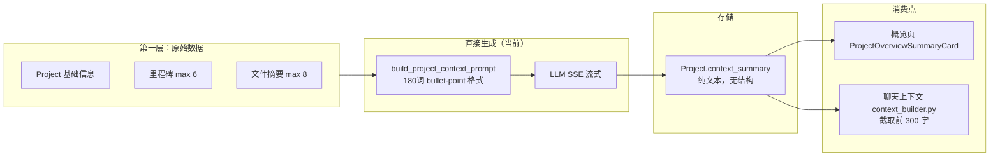
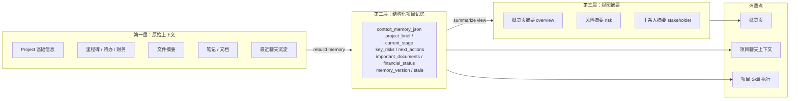
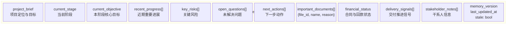
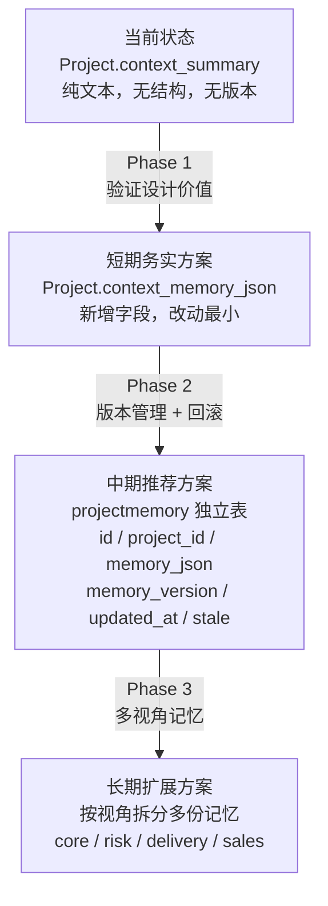
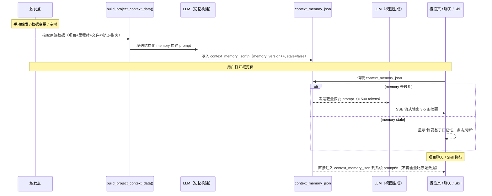
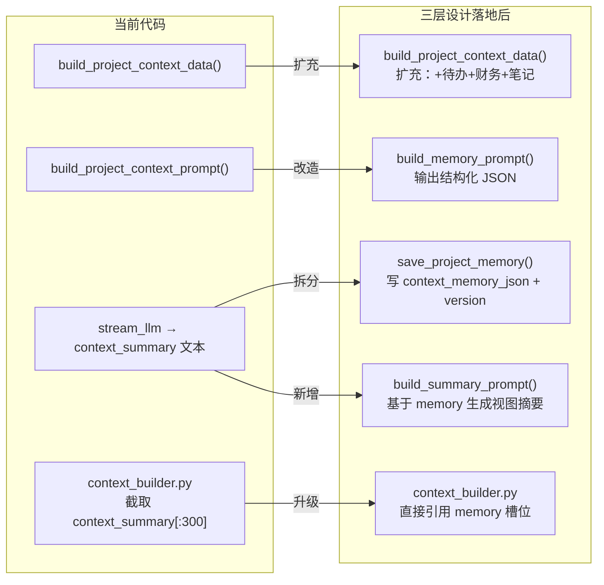
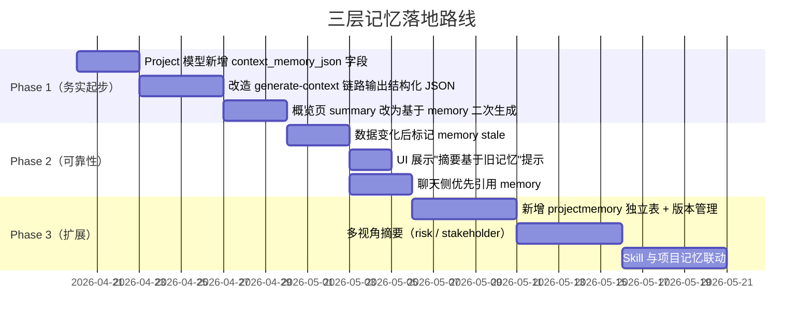

# AriaAI 项目三层记忆设计

更新日期：2026-04-17（含代码现状核查）

适用范围：项目概览页 `AI 项目总结`、项目聊天上下文、项目级 Skill、项目级生成物等依赖项目长期上下文的能力。

---

## 0. 当前代码现状（vs. 本文设计目标）

| 层 | 本文设计 | 当前代码状态 |
|----|---------|------------|
| 第一层：原始上下文 | 项目原始数据聚合 | ✅ 已落地：`build_project_context_data()`，聚合项目基础信息 + 里程碑（max 6）+ 文件（max 8）+ 文件摘要——**这是面向实时视图摘要的精简版**。三层设计引入 `build_project_memory_data()`，不限数量，全量喂给记忆构建 |
| 第二层：结构化记忆 | `context_memory_json` / `projectmemory` 表 | ❌ 尚未落地：`Project.context_summary` 只是一段文本，无结构化槽位，无版本，无 stale 标记 |
| 第三层：视图摘要 | 基于记忆层按视角生成 | ⚠️ 部分落地：`POST /projects/{id}/generate-context` 直接从原始数据流式生成，跳过第二层直接写 `context_summary` |

**当前实质是"两层"：原始数据 → 直接生成 → `context_summary` 文本。**  
本文设计的核心价值是在中间插入第二层，让第三层基于结构化记忆而非原始全量数据生成。

### 当前数据流（实际）



### 目标数据流（本文设计）



---

## 1. 背景

当前项目侧 AI 能力已经具备以下基础：

- 项目详情、里程碑、文件、待办、财务等数据都可被后端聚合
- 文件级 `summary` 已存在
- 项目级 `context_summary` 已存在
- 项目聊天已支持流式输出、RAG 引用、工具调用和生成物

但目前“AI 项目总结”仍然存在一个结构性问题：

- 为了得到足够完整的结论，需要把尽可能多的项目上下文一次性喂给模型
- 一次性全量总结会带来首字慢、易截断、成本高、稳定性差的问题

这说明当前系统需要的不是继续调 prompt 或单纯加大 `max_tokens`，而是引入一层更稳定的“项目记忆”。

---

## 2. 设计目标

本设计希望同时满足以下目标：

1. AI 能基于尽可能完整的项目上下文工作
2. 页面侧总结响应更快，首屏更早
3. 不再依赖“每次点击都全量重算”
4. 项目上下文可被聊天、Skill、生成物等多个能力复用
5. 支持后续做不同视角总结，而不是只有一个统一摘要

---

## 3. 非目标

本设计文档当前不覆盖：

- 具体数据库迁移脚本
- 前端视觉细节
- 全量历史聊天的复杂召回策略
- 向量数据库层面的重构
- 多租户权限细节

这份文档主要聚焦于“项目长期记忆”的分层设计。

---

## 4. 为什么要做三层

如果只有两层：

1. 原始项目数据
2. 页面展示摘要

那么页面摘要就必须直接承担“理解全量项目”的职责，导致：

- 每次生成都要吃很多原始数据
- 非常依赖 prompt 和 token 预算
- 不容易增量更新
- 不容易支持不同视角复用

因此更适合的方案是三层：

1. 原始上下文层 `raw context`
2. 结构化项目记忆层 `structured memory`
3. 视图摘要层 `view summary`

这三层的职责应该明确分开。

---

## 5. 三层定义

### 5.1 第一层：原始上下文层

这是项目真实数据的来源层，包含：

- 项目基础信息与描述（完整）
- 所有里程碑（不限数量）
- 所有项目文件 + 文件摘要（不限数量）
- 待办、财务流水（后续扩充）
- 项目笔记与 Markdown 文档
- 聊天中沉淀下来的项目知识

这一层的特点：

- 信息最全，**面向记忆构建不做数量截断**
- 结构最杂，更新最频繁
- 不直接用于实时页面渲染（那是视图层的职责）

> **与现有 `build_project_context_data()` 的区别**：该函数限制里程碑 6 条、文件 8 条，是为了控制实时摘要的 token。记忆构建使用新函数 `build_project_memory_data()`，全量输出。

### 5.2 第二层：结构化项目记忆层

这是本方案的核心。

这一层不是简单的一段大摘要，而是一个结构化 memory object，用来保存项目的长期记忆。

建议按槽位组织，例如：

```json
{
  "project_brief": "",
  "current_stage": "",
  "current_objective": "",
  "recent_progress": [],
  "key_risks": [],
  "open_questions": [],
  "next_actions": [],
  "important_documents": [],
  "financial_status": "",
  "delivery_signals": [],
  "stakeholder_notes": [],
  "last_updated_at": ""
}
```

这一层的特点：

- 不是面向用户展示的最终文案
- 是 AI 可复用、可更新、可解释的项目记忆
- 适合被聊天、Skill、概览页、生成物统一使用

### 5.3 第三层：视图摘要层

这是面向不同场景即时生成的摘要层。

例如：

- 概览页 `AI 项目总结`
- 风险摘要
- 管理层摘要
- 客户沟通摘要
- 交付经理摘要

这一层只关心“怎么展示给当前用户看”，不承担长期记忆职责。

---

## 6. 推荐的数据结构

### 6.1 项目记忆主结构（结构化槽位图）



实际 JSON 示例：

```json
{
  "project_brief": "项目是什么、为什么做",
  "current_stage": "当前所处阶段",
  "current_objective": "当前阶段的核心目标",
  "recent_progress": ["最近的重要进展"],
  "key_risks": ["关键风险"],
  "open_questions": ["仍未解决的问题"],
  "next_actions": ["接下来应推进的动作"],
  "important_documents": [
    { "file_id": 12, "name": "客户需求访谈纪要.md", "reason": "定义了本轮范围边界" }
  ],
  "financial_status": "合同和回款状态摘要",
  "delivery_signals": ["交付推进信号"],
  "stakeholder_notes": ["关键干系人信息"],
  "memory_version": 1,
  "last_updated_at": "2026-04-17T12:00:00Z",
  "stale": false
}
```

### 6.2 视图摘要结构

第三层可以是轻量结果，不必长期存完整历史，只需存最近一次结果或缓存：

```json
{
  "summary_type": "overview",
  "content": "- ...",
  "source_memory_version": 1,
  "generated_at": "2026-04-17T12:03:00Z"
}
```

---

## 7. 推荐的存储方式

### 存储方案对比



### 7.1 短期务实方案

在现有 `Project` 模型上新增一个字段：

- `context_memory_json`
- `memory_stale: bool = True`

优点：改动小，实现快，可先验证设计价值  
缺点：字段会逐渐变重，不利于多版本记录

### 7.2 中期推荐方案

新增独立表，例如：

- `projectmemory`

建议字段：

- `id`
- `project_id`
- `memory_json`
- `memory_version`
- `updated_at`
- `source_snapshot_hash`

优点：

- 更利于版本管理
- 便于回滚、观察和调试
- 后续可以支持多视角 memory

### 7.3 长期扩展方案

当系统进一步复杂后，可以把 memory 拆分为多份：

- `project_core_memory`
- `project_risk_memory`
- `project_delivery_memory`
- `project_sales_memory`

当前阶段不建议一开始就拆这么细。

---

## 8. 生成链路设计

### 完整链路图



### 8.1 第一阶段：从原始上下文构建结构化记忆

输入（当前 `build_project_context_data()` 覆盖）：
- 项目基础信息、文件摘要、里程碑

输入（待扩充）：
- 待办、财务流水、项目笔记

输出：`context_memory_json`

特点：可以异步做，不要求用户点击时才生成，更适合在数据变化后增量更新

### 8.2 第二阶段：从结构化记忆生成页面摘要

输入：

- `context_memory_json`
- 少量最新动态

输出：

- 概览页可展示的 3-5 条项目总结

特点：

- 快
- 稳
- prompt 更简单
- token 预算更可控

### 8.3 第三阶段：按不同视角生成派生摘要

例如：

- `overview`
- `risk`
- `stakeholder`
- `delivery`
- `client-facing`

这一步不一定一开始就做，但三层架构天然支持。

---

## 9. 更新策略

### 9.1 全量重建

适合初期：

- 手动触发
- 定时任务触发
- 项目概览页点击触发

优点：

- 简单

缺点：

- 成本高
- 慢

### 9.2 增量更新

推荐中期演进方向。

在以下事件发生时，局部更新 memory：

- 新文件上传
- 文件摘要完成
- 里程碑变更
- 待办变更
- 财务记录变更
- 项目笔记更新

思路：

- 不直接重写最终摘要
- 先更新对应 memory 槽位
- 页面总结只读取最新 memory 再即时生成

### 9.3 惰性刷新

折中方案：

- 数据变化时只标记 memory 为 stale
- 用户下次打开概览页或聊天页时再重建

这种方式在工程上通常最省。

---

## 10. 接口草案

### 10.1 构建或刷新项目记忆

`POST /projects/{project_id}/memory/rebuild`

用途：

- 重建项目结构化记忆

返回：

```json
{
  "ok": true,
  "memory_version": 3,
  "updated_at": "2026-04-17T12:00:00Z"
}
```

### 10.2 读取项目记忆

`GET /projects/{project_id}/memory`

用途：

- 获取当前项目结构化记忆

### 10.3 生成指定视角摘要

`POST /projects/{project_id}/memory/summarize`

请求体示例：

```json
{
  "summary_type": "overview"
}
```

### 10.4 查询记忆状态

`GET /projects/{project_id}/memory/status`

返回：

- 是否存在
- 是否 stale
- 最近更新时间
- 最近生成版本

---

## 11. 与现有代码的关系

### 现有可复用点（代码已落地）

| 现有代码 | 文件 | 在三层设计中的角色 |
|---------|------|-----------------|
| `build_project_context_data()` | `services/project_contexts.py` | **保留**，继续用于实时视图摘要（带数量 cap）|
| `build_project_memory_data()`（新增） | `services/project_contexts.py` | 第一层全量聚合，无数量限制，专门用于记忆构建 |
| `build_project_context_prompt()` | `services/project_contexts.py` | 改造为"记忆构建 prompt"，输出结构化 JSON 而非纯文本 |
| `save_project_context_summary()` | `services/project_contexts.py` | 改造为 `save_project_memory()`，写入 `context_memory_json` |
| `POST /projects/{id}/generate-context` | `routers/projects.py` | 重构为"重建记忆"链路，第二步轻量生成摘要 |
| `Project.context_summary` | `models/db.py` | 短期方案：保留兼容，新增 `context_memory_json` 字段 |
| `Project.context_freshness` | `models/db.py` | 可复用为 `memory_stale` 语义 |
| `context_builder.py` 上下文注入 | `services/context_builder.py` | 现在截取 `context_summary[:300]`，改为直接注入 memory |

### 改造路径示意



---

## 12. 性能收益预期

如果三层设计落地，理论上会带来以下收益：

- 概览页摘要生成更快
- 首字响应更早
- 不容易被 `max_tokens` 截断
- 总结风格更稳定
- 后续多视角摘要复用成本更低
- 项目聊天无需反复吃全量原始数据

---

## 13. 风险与权衡

### 13.1 记忆过期风险

如果 memory 不及时更新，摘要可能变旧。

应对方式：

- 记录 `updated_at`
- 标记 `stale`
- 在 UI 上可提示“摘要基于最近一次记忆构建”

### 13.2 结构化过度风险

如果中间层设计太复杂，会拖慢初期上线。

应对方式：

- 先做单份 `context_memory_json`
- 先做少量核心槽位
- 先允许全量重建，不急着一步做到增量

### 13.3 记忆失真风险

AI 生成的 memory 可能会误归纳。

应对方式：

- 给 memory 保留来源字段
- 高价值槽位尽量引用原始对象 ID
- 先把它作为“辅助记忆”而不是绝对真相

---

## 14. 分阶段落地建议



### Phase 1（技术验证）

- `Project` 模型新增 `context_memory_json`（JSON 字段）和 `memory_stale`（bool）
- 改造 `build_project_context_prompt()` 输出结构化 JSON 而非纯文本
- 改造 `generate-context` SSE 链路：第一步写 memory，第二步读 memory 生成概览摘要
- 前端：概览页 summary 展示不变，内部改为基于 memory 二次生成

### Phase 2（可靠性）

- 数据变化事件（文件上传、里程碑变更、财务更新）后标记 `memory_stale = True`
- 聊天 `context_builder.py` 改为引用 `context_memory_json` 核心槽位
- UI 提示"摘要基于最近一次记忆构建，上次更新：XXX"

### Phase 3（扩展）

- 新增 `projectmemory` 独立表，支持多版本回滚
- 支持按视角生成不同摘要（risk / stakeholder / delivery）
- Skill 执行时自动携带项目记忆

---

## 15. 建议结论

如果只考虑当前问题，“两层”已经比现在好很多。

但如果目标是让 AriaAI 的项目能力真正可扩展、可复用、可长期维护，那么更推荐采用三层架构：

1. 原始上下文层
2. 结构化项目记忆层
3. 视图摘要层

其中第二层是关键。只要这一层设计正确，概览页总结、项目聊天、项目 Skill 和后续生成物能力都会明显更稳。

---

## 16. 当前建议

当前最推荐的下一步不是马上开发全部，而是先做一版小型技术方案确认：

1. 明确 `context_memory_json` 的最终字段
2. 确定更新触发策略
3. 确定概览页 summary 是否完全改为“基于 memory 的二次总结”

等这三件事达成一致，再进入开发，会比继续在现有 `context_summary` 上做局部调参更值得。
