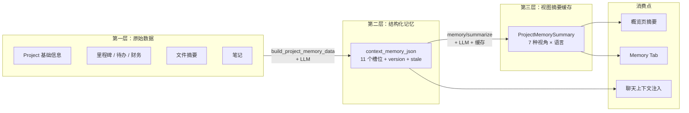
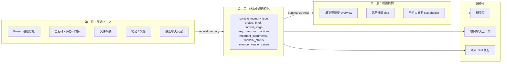
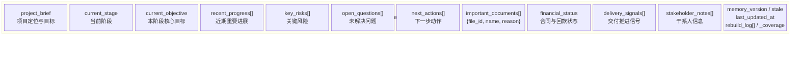
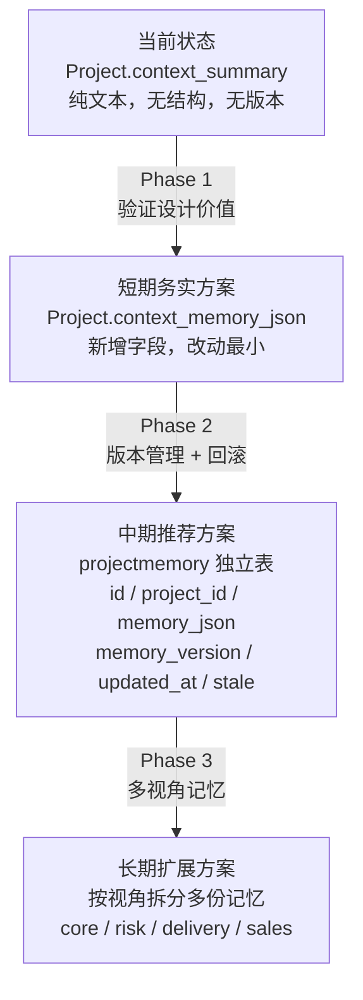
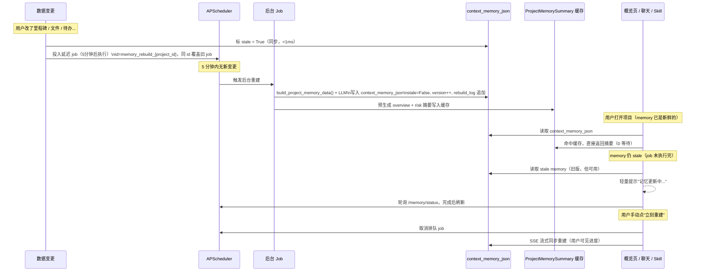
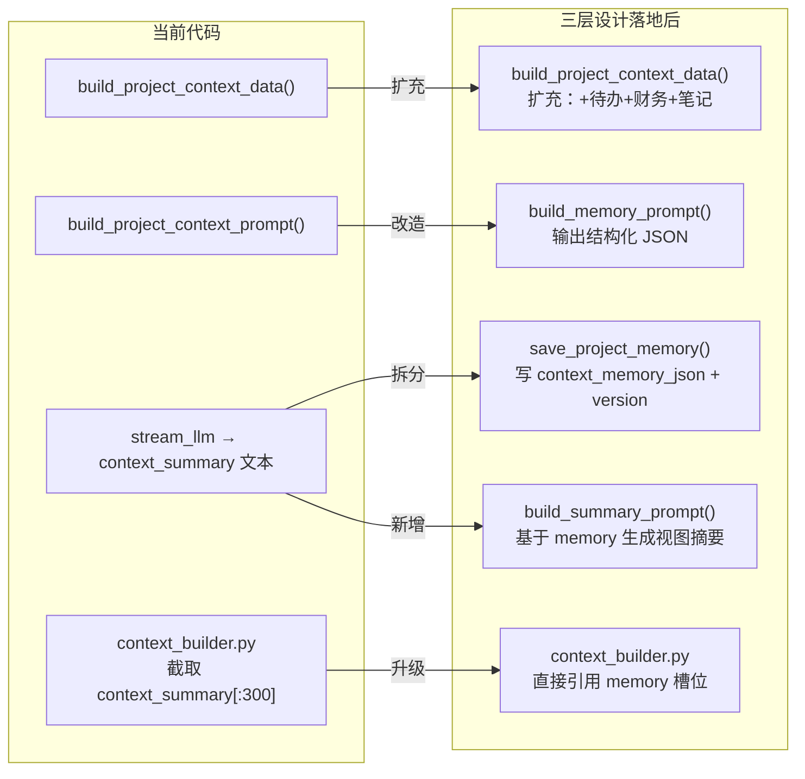
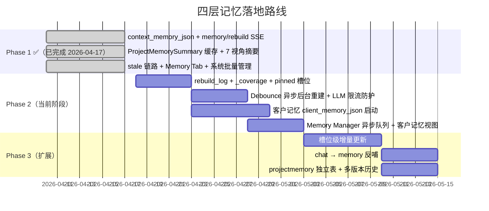

# AriaAI 项目记忆架构设计

更新日期：2026-04-18

适用范围：项目概览页 `AI 项目总结`、项目聊天上下文、项目级 Skill、项目级生成物，以及跨项目的客户级知识积累。

---

## 0. 当前代码现状（vs. 本文设计目标）

| 层 | 本文设计 | 当前代码状态 |
|----|---------|------------|
| 第一层：原始上下文 | 项目原始数据聚合 | ✅ 已落地：`build_project_context_data()`，聚合项目基础信息 + 里程碑（max 6）+ 文件（max 8）+ 文件摘要——**这是面向实时视图摘要的精简版**。三层设计引入 `build_project_memory_data()`，不限数量，全量喂给记忆构建 |
| 第二层：结构化记忆 | `context_memory_json` / `projectmemory` 表 | ✅ 已落地：`Project` 新增 `context_memory_json / memory_stale / memory_version / memory_updated_at`；`save_project_memory()` / `parse_project_memory()` / `get_project_memory_payload()` 全部可用 |
| 第三层：视图摘要 | 基于记忆层按视角生成 | ✅ 已落地：7 个视角（overview / risk / stakeholder / delivery / client-facing / financial / documents）；`ProjectMemorySummary` 缓存表按 `project_id + memory_version + summary_type + language` 缓存；SSE 流式 |

**V1 主链路已跑通**，三层都有对应实现。当前系统满足业务可用，下阶段目标是槽位级增量更新与更强的知识反哺闭环。详见 [09-项目记忆落地进度.md](./09-项目记忆落地进度.md)。

### 当前数据流（Phase 1 已落地）



### 目标数据流（本文设计）



---

## 1. 背景

当前项目侧 AI 能力已经具备以下基础：

- 项目详情、里程碑、文件、待办、财务等数据都可被后端聚合
- 文件级 `summary` 已存在
- 项目级 `context_summary` 已存在
- 项目聊天已支持流式输出、RAG 引用、工具调用和生成物

但目前“AI 项目总结”仍然存在一个结构性问题：

- 为了得到足够完整的结论，需要把尽可能多的项目上下文一次性喂给模型
- 一次性全量总结会带来首字慢、易截断、成本高、稳定性差的问题

这说明当前系统需要的不是继续调 prompt 或单纯加大 `max_tokens`，而是引入一层更稳定的“项目记忆”。

---

## 2. 设计目标

本设计希望同时满足以下目标：

1. AI 能基于尽可能完整的项目上下文工作
2. 页面侧总结响应更快，首屏更早
3. 不再依赖”每次点击都全量重算”
4. 项目上下文可被聊天、Skill、生成物等多个能力复用
5. 支持后续做不同视角总结，而不是只有一个统一摘要
6. 同一客户的多个项目之间，知识可以积累和复用——这是咨询行业最核心的竞争力来源

---

## 3. 非目标

本设计文档当前不覆盖：

- 具体数据库迁移脚本
- 前端视觉细节
- 全量历史聊天的复杂召回策略
- 向量数据库层面的重构
- 多租户权限细节

这份文档主要聚焦于“项目长期记忆”的分层设计。

---

## 4. 为什么从两层到三层，再到四层

### 两层的问题

如果只有原始数据 + 页面摘要，摘要必须直接消化全量数据：慢、贵、容易截断、无法复用。

三层通过引入结构化记忆解决了这个问题（已落地）。

### 三层的剩余问题

三层很好地解决了**单个项目内**的 AI 上下文质量问题。但咨询产品的用户不只做一个项目——他们服务同一个客户、做同类型的项目、遇到相似的风险。

三层记忆是项目级的工作记忆，但**没有跨项目的长期记忆**。每次开新项目，AI 从零开始认识这个客户。

### 第四层：客户记忆

```
全局知识库（RAG，已有）
    ↑
客户记忆 client_memory    ← 第四层，待落地
    ↑
项目记忆 context_memory   ← 三层，已落地
    ↑
原始项目数据
```

第四层积累的是跨项目的客户级知识：

- 这个客户的决策风格和关键人
- 历史项目的经验教训
- 哪些方案被接受过、哪些失败过
- 客户内部的敏感议题

这层不随单个项目建立，而是随着为同一客户服务的每个项目**自然积累**。

---

## 4.5 外部参照：Karpathy LLM Wiki 的验证

Andrej Karpathy 在 2026 年提出了一套名为 "LLM Wiki" 的个人知识库模式，其核心主张与本设计高度吻合：

> **"知识应该编译一次、保持更新（compile once, keep current），而不是每次查询都从原始数据重新推导。"**
> 
> 他将这种中间层称为 "persistent, compounding artifact"——知识库随每次 ingest 增量变厚，而不是每次重算。

他的三层结构与 AriaAI 设计对应如下：

| Karpathy LLM Wiki | AriaAI 三层记忆 | 对应状态 |
|-------------------|----------------|---------|
| Raw sources（原始文档） | 第一层：项目原始数据 | ✅ |
| Wiki（LLM 维护的 markdown） | 第二层：`context_memory_json` | ✅ |
| Schema（CLAUDE.md 约定 LLM 怎么维护） | `build_memory_prompt()` | ✅ 已实现，可进一步显式化 |

**Karpathy 的三个洞见对本系统的具体启示：**

### 洞见 1：把 `build_memory_prompt` 当 schema 来设计

Karpathy 强调 schema 是整个系统最关键的配置文件——它决定 LLM 以什么标准维护知识库。对应 AriaAI，`build_project_memory_prompt()` 就是这个 schema：它不只是"总结项目"，而是"为所有后续 AI 用途编译一份标准化的项目知识文件"。

当前 prompt 已覆盖核心槽位，但可以持续显式化这层含义：让 prompt 明确告知 LLM 每个槽位的用途、谁会消费它（聊天 / Skill / 视图摘要）。

### 洞见 2：记忆重建日志（rebuild log）

Karpathy 用 `log.md`（追加式时间线）记录每次 ingest 了什么、何时发生。当前 AriaAI 只有 `memory_version` 整数和 `memory_updated_at`。

建议在 `context_memory_json` 中加入：
```json
"rebuild_log": [
  { "at": "2026-04-17T12:00:00Z", "trigger": "manual", "version": 3 },
  { "at": "2026-04-15T09:10:00Z", "trigger": "milestone_changed", "version": 2 }
]
```
成本极低，调试和 UI 提示（"上次因里程碑变更于 XX 重建"）都更有用。

### 洞见 3：好的聊天答案应该写回 memory

Karpathy：*"好答案不应该消失在对话历史里，应该 file back 成 wiki 页面。"*

AriaAI 已有"聊天沉淀为项目笔记"功能，但还没有"高质量聊天答案更新 memory 槽位"的显式路径。这是未来闭环最关键的一段：
```
用户问项目风险 → AI 给出风险分析 → 一键更新 key_risks 槽位
```

---

## 5. 三层定义

### 5.1 第一层：原始上下文层

这是项目真实数据的来源层，包含：

- 项目基础信息与描述（完整）
- 所有里程碑（不限数量）
- 所有项目文件 + 文件摘要（不限数量）
- 待办、财务流水（后续扩充）
- 项目笔记与 Markdown 文档
- 聊天中沉淀下来的项目知识

这一层的特点：

- 信息最全，**面向记忆构建不做数量截断**
- 结构最杂，更新最频繁
- 不直接用于实时页面渲染（那是视图层的职责）

> **与现有 `build_project_context_data()` 的区别**：该函数限制里程碑 6 条、文件 8 条，是为了控制实时摘要的 token。记忆构建使用新函数 `build_project_memory_data()`，全量输出。

### 5.2 第二层：结构化项目记忆层

这是本方案的核心。

这一层不是简单的一段大摘要，而是一个结构化 memory object，用来保存项目的长期记忆。

建议按槽位组织，例如：

```json
{
  "project_brief": "",
  "current_stage": "",
  "current_objective": "",
  "recent_progress": [],
  "key_risks": {
    "ai": ["AI 归纳的关键风险"],
    "pinned": ["用户手写、重建时不覆盖的风险"]
  },
  "open_questions": [],
  "next_actions": [],
  "important_documents": [],
  "financial_status": "",
  "delivery_signals": [],
  "stakeholder_notes": [],
  "memory_version": 1,
  "last_updated_at": "",
  "stale": false,
  "rebuild_log": [
    { "at": "2026-04-18T10:00:00Z", "trigger": "milestone_changed", "version": 1 }
  ],
  "_coverage": {
    "milestones_total": 8,
    "files_total": 5,
    "todos_total": 12,
    "built_at": "2026-04-18T10:00:00Z"
  }
}
```

`pinned` 字段存在于每个支持用户手写的槽位（`key_risks`、`stakeholder_notes`、`open_questions` 等）。AI 重建时只更新 `ai` 子字段，`pinned` 不被覆盖。

这一层的特点：

- 不是面向用户展示的最终文案
- 是 AI 可复用、可更新、可解释的项目记忆
- 适合被聊天、Skill、概览页、生成物统一使用

### 5.3 第三层：视图摘要层

这是面向不同场景即时生成的摘要层。

例如：

- 概览页 `AI 项目总结`
- 风险摘要
- 管理层摘要
- 客户沟通摘要
- 交付经理摘要

这一层只关心”怎么展示给当前用户看”，不承担长期记忆职责。

### 5.4 第四层：客户记忆层（待落地）

这是跨项目的长期积累层，挂在 `ClientRecord` 上，而不是单个项目上。

```json
{
  “client_profile”: “客户是谁、行业背景、规模”,
  “decision_patterns”: [“Q4 预算冻结，避开这个窗口谈合同”],
  “key_contacts”: [
    { “name”: “张总”, “role”: “CFO”, “note”: “真正的决策人，非 CEO” }
  ],
  “lessons_learned”: [
    “方案 A 在 2025 年初试过，客户接受度低，主要反对来自技术部门”
  ],
  “project_history”: [
    { “project_id”: 12, “name”: “XX 咨询项目”, “outcome”: “赢单”, “key_factor”: “...” }
  ],
  “sensitive_topics”: [“内部有裁员计划，不宜在提案中涉及”],
  “memory_version”: 3,
  “last_updated_at”: “2026-04-18T...”
}
```

**更新策略**：
- 项目完成或归档时，自动将该项目 memory 的精华提炼归入客户记忆
- 顾问也可以手动向客户记忆写入关键观察（`pinned` 机制）
- 客户记忆不随单个项目重建，长期保留

**消费策略**：
- 聊天知识范围切换为”客户”时，优先注入 `client_memory_json`
- 新建该客户的新项目时，自动以客户记忆作为初始上下文提示顾问

**与现有代码的关系**：
- `ClientRecord` 模型已存在，新增 `client_memory_json` 字段即可
- 聊天知识范围 `project / client / global` 已有，`client` 档当前走 RAG，升级为优先走客户记忆
- `KnowledgeDocument.client_id` 已有，客户级知识积累的基础已打好

---

## 6. 推荐的数据结构

### 6.1 项目记忆主结构（结构化槽位图）



实际 JSON 示例：

```json
{
  "project_brief": "项目是什么、为什么做",
  "current_stage": "当前所处阶段",
  "current_objective": "当前阶段的核心目标",
  "recent_progress": ["最近的重要进展"],
  "key_risks": {
    "ai": ["客户决策周期长，影响交付节奏"],
    "pinned": ["客户内部有反对声音，是最大的风险——顾问手写，AI 不覆盖"]
  },
  "open_questions": {
    "ai": ["仍未解决的问题"],
    "pinned": []
  },
  "next_actions": ["接下来应推进的动作"],
  "important_documents": [
    { "file_id": 12, "name": "客户需求访谈纪要.md", "reason": "定义了本轮范围边界" }
  ],
  "financial_status": "合同和回款状态摘要",
  "delivery_signals": ["交付推进信号"],
  "stakeholder_notes": {
    "ai": ["关键干系人信息"],
    "pinned": []
  },
  "memory_version": 3,
  "last_updated_at": "2026-04-17T12:00:00Z",
  "stale": false,
  "rebuild_log": [
    { "at": "2026-04-17T12:00:00Z", "trigger": "manual", "version": 3 },
    { "at": "2026-04-15T09:10:00Z", "trigger": "milestone_changed", "version": 2 },
    { "at": "2026-04-13T08:00:00Z", "trigger": "file_uploaded", "version": 1 }
  ],
  "_coverage": {
    "milestones_total": 12,
    "files_total": 8,
    "todos_total": 20,
    "built_at": "2026-04-17T12:00:00Z"
  }
}
```

### 6.2 视图摘要结构

第三层可以是轻量结果，不必长期存完整历史，只需存最近一次结果或缓存：

```json
{
  "summary_type": "overview",
  "content": "- ...",
  "source_memory_version": 1,
  "generated_at": "2026-04-17T12:03:00Z"
}
```

---

## 7. 推荐的存储方式

### 存储方案对比



### 7.1 短期务实方案

在现有 `Project` 模型上新增一个字段：

- `context_memory_json`
- `memory_stale: bool = True`

优点：改动小，实现快，可先验证设计价值  
缺点：字段会逐渐变重，不利于多版本记录

### 7.2 中期推荐方案

新增独立表，例如：

- `projectmemory`

建议字段：

- `id`
- `project_id`
- `memory_json`
- `memory_version`
- `updated_at`
- `source_snapshot_hash`

优点：

- 更利于版本管理
- 便于回滚、观察和调试
- 后续可以支持多视角 memory

### 7.3 长期扩展方案

当系统进一步复杂后，可以把 memory 拆分为多份：

- `project_core_memory`
- `project_risk_memory`
- `project_delivery_memory`
- `project_sales_memory`

当前阶段不建议一开始就拆这么细。

---

## 8. 生成链路设计

### 完整链路图（含异步流水线）



### 8.1 第一阶段：从原始上下文构建结构化记忆

输入（`build_project_memory_data()` 全量聚合，已落地）：
- 项目基础信息、文件摘要、里程碑（无数量限制）
- 待办、财务流水、项目笔记

输出：`context_memory_json`（11 个槽位 + rebuild_log + _coverage + stale）

特点：可以异步做，不要求用户点击时才生成，更适合在数据变化后增量更新

### 8.2 第二阶段：从结构化记忆生成页面摘要

输入：

- `context_memory_json`
- 少量最新动态

输出：

- 概览页可展示的 3-5 条项目总结

特点：

- 快
- 稳
- prompt 更简单
- token 预算更可控

### 8.3 第三阶段：按不同视角生成派生摘要

例如：

- `overview`
- `risk`
- `stakeholder`
- `delivery`
- `client-facing`

这一步不一定一开始就做，但三层架构天然支持。

---

## 9. 更新策略

### 9.1 当前：惰性刷新（已落地）

数据变化时只标记 `stale = True`，重建由用户手动触发或页面加载触发。

- 优点：实现最简单
- 缺点：用户需要等待，体验断层

### 9.2 推荐：Debounce 异步后台重建（待落地）

复用已有的 `APScheduler`，不需要引入 Celery / Redis：

```python
def mark_project_memory_stale(session, project_id, trigger: str):
    project.memory_stale = True
    # 投入延迟 job，5 分钟内有新变更则自动覆盖（debounce）
    scheduler.add_job(
        rebuild_memory_background,
        trigger="date",
        run_date=datetime.utcnow() + timedelta(minutes=5),
        id=f"memory_rebuild_{project_id}",   # 同 id 自动覆盖旧 job
        replace_existing=True,
        args=[project_id, trigger]
    )
```

后台 job 完成后：
1. `stale = False`，`version++`，写 `rebuild_log`
2. 预生成 `overview` + `risk` 摘要写入缓存

用户体验：
- **改了数据 → 打开项目**：memory 已是新鲜的，摘要直接走缓存，0 等待
- **改了数据 → 5 分钟内打开**：显示"记忆更新中…"，轮询 `/memory/status` 完成后刷新
- **用户手动点"立刻重建"**：取消排队 job，走 SSE 同步流式，用户可见进度

### 9.3 LLM 限流防护

异步后台带来的最大风险：多项目同时触发重建，大量 LLM 请求集中打出，触发 API 限流（429）甚至账单激增。

#### 三道防线

**第一道：并发上限**

APScheduler 使用独立的 ThreadPoolExecutor，限制最大并发 job 数：

```python
# main.py lifespan 中配置
from apscheduler.executors.pool import ThreadPoolExecutor

executors = {
    "memory": ThreadPoolExecutor(max_workers=2)  # 同时最多 2 个重建 job
}
scheduler = BackgroundScheduler(executors=executors)
```

同时最多 2 个项目在后台重建，其余排队等待。

**第二道：优先级队列**

按来源区分优先级，高优先级任务不受并发限制影响：

| 优先级 | 来源 | 行为 |
|-------|------|------|
| P0 | 用户手动触发 | SSE 同步，立刻执行，取消同项目排队 job |
| P1 | 页面加载触发（用户正在看） | 插队到 debounce job 之前 |
| P2 | Debounce 后台 job | 正常排队，受并发限制 |
| P3 | 批量补齐（管理员操作） | 最低优先级，加额外间隔 |

**第三道：失败退避 + 速率限制**

后台 job 内部调用 LLM 时，遇到 429 / 超时自动退避重试：

```python
async def rebuild_memory_background(project_id, trigger):
    for attempt in range(3):
        try:
            await _do_rebuild(project_id, trigger)
            return
        except RateLimitError:
            wait = 60 * (2 ** attempt)   # 1min → 2min → 4min
            await asyncio.sleep(wait)
        except Exception:
            # 非限流错误，记录失败状态，不重试
            mark_rebuild_failed(project_id)
            return
```

批量重建时（管理员操作），在每个 job 之间强制插入最小间隔：

```python
# 批量重建：每个项目至少间隔 30 秒
for project_id in stale_project_ids:
    scheduler.add_job(rebuild_memory_background, "date",
                      run_date=now + timedelta(seconds=30 * i),
                      args=[project_id, "batch"])
```

#### 每日预算上限（可选）

系统设置中可配置每日最大后台重建次数，防止极端情况：

```
MEMORY_REBUILD_DAILY_LIMIT = 200   # 默认值，管理员可调
```

超出后，新的 debounce job 只标 stale，不投入后台执行，等待管理员手动批量或次日自动恢复。

### 9.4 未来：槽位级增量更新

数据变化时只更新对应槽位，不整包重建：

| 触发事件 | 更新槽位 |
|---------|---------|
| 里程碑变更 | `recent_progress` + `next_actions` |
| 财务记录变更 | `financial_status` |
| 文件上传 / 摘要完成 | `important_documents` |
| 待办变更 | `next_actions` + `open_questions` |

每次只发一个小 prompt，成本远低于整包重建。

---

## 10. 接口草案

### 10.1 构建或刷新项目记忆

`POST /projects/{project_id}/memory/rebuild`

用途：重建项目结构化记忆（SSE 流式，支持进度可见）。调用时自动取消同项目排队中的 debounce job。

返回：

```json
{
  "ok": true,
  "memory_version": 3,
  "updated_at": "2026-04-17T12:00:00Z"
}
```

### 10.2 读取项目记忆

`GET /projects/{project_id}/memory`

用途：获取当前项目结构化记忆，包含所有槽位、`rebuild_log`、`_coverage`、`stale` 状态。

### 10.3 生成指定视角摘要

`POST /projects/{project_id}/memory/summarize`

请求体示例：

```json
{
  "summary_type": "overview",
  "language": "zh",
  "force_refresh": false
}
```

- `summary_type`：支持 `overview / risk / stakeholder / delivery / client-facing / financial / documents`
- `language`：`zh` / `en`，不传时跟随 UI 语言
- `force_refresh`：`true` 时跳过缓存，重新生成并回写缓存

### 10.4 查询记忆状态

`GET /projects/{project_id}/memory/status`

返回：

```json
{
  "exists": true,
  "stale": false,
  "memory_version": 3,
  "updated_at": "2026-04-17T12:00:00Z",
  "rebuild_status": "idle",
  "last_trigger": "milestone_changed"
}
```

`rebuild_status` 可为 `idle / rebuilding / failed`。

### 10.5 批量重建（管理员）

`POST /projects/memory/rebuild-batch`

请求体示例：

```json
{
  "mode": "stale_only",
  "interval_seconds": 30
}
```

- `mode`：`stale_only`（只重建 stale 项目）/ `missing_only`（补齐无 memory 项目）/ `all`
- `interval_seconds`：批量 job 之间的最小间隔（防止 LLM 限流，默认 30）

返回已加入队列的项目数量。

### 10.6 异步 Job 管理（管理员）

`GET /admin/memory/jobs`

返回当前 APScheduler 队列中的 memory job 列表：

```json
[
  {
    "project_id": 42,
    "project_name": "XX 咨询",
    "job_type": "scheduled",
    "run_at": "2026-04-17T12:05:00Z",
    "trigger": "milestone_changed"
  }
]
```

`POST /admin/memory/jobs/{project_id}/cancel`：取消某项目的排队 job。

`POST /admin/memory/jobs/{project_id}/run-now`：将排队 job 立刻执行（插队）。

### 10.7 客户记忆（第四层，待落地）

`GET /clients/{client_id}/memory`：读取客户记忆。

`POST /clients/{client_id}/memory/rebuild`：从该客户已归档项目提炼并重建客户记忆。

`POST /clients/{client_id}/memory/pin`：手动向客户记忆写入 pinned 内容。

---

## 11. 与现有代码的关系

### 现有可复用点（代码已落地）

| 现有代码 | 文件 | 在三层设计中的角色 |
|---------|------|-----------------|
| `build_project_context_data()` | `services/project_contexts.py` | **保留**，继续用于实时视图摘要（带数量 cap）|
| `build_project_memory_data()`（新增） | `services/project_contexts.py` | 第一层全量聚合，无数量限制，专门用于记忆构建 |
| `build_project_context_prompt()` | `services/project_contexts.py` | 改造为"记忆构建 prompt"，输出结构化 JSON 而非纯文本 |
| `save_project_context_summary()` | `services/project_contexts.py` | 改造为 `save_project_memory()`，写入 `context_memory_json` |
| `POST /projects/{id}/generate-context` | `routers/projects.py` | 重构为"重建记忆"链路，第二步轻量生成摘要 |
| `Project.context_summary` | `models/db.py` | 短期方案：保留兼容，新增 `context_memory_json` 字段 |
| `Project.context_freshness` | `models/db.py` | 可复用为 `memory_stale` 语义 |
| `context_builder.py` 上下文注入 | `services/context_builder.py` | 现在截取 `context_summary[:300]`，改为直接注入 memory |

### 改造路径示意



---

## 12. 性能收益（Phase 1 已验证）

三层设计已落地，已实现的收益：

- **概览页摘要生成更快**：基于缓存的 `ProjectMemorySummary`，同版本直接返回，0 LLM 调用
- **首字响应更早**：第三层从 memory 生成摘要，输入更短，首字更快
- **不容易被 `max_tokens` 截断**：memory 本身是紧凑的结构化对象，而非全量原始数据
- **总结风格更稳定**：每次从同一份 memory 出发，prompt 更短，风格更可控
- **多视角摘要复用成本更低**：7 个视角共享同一份 memory，只有 prompt 不同
- **项目聊天无需反复吃全量原始数据**：`context_builder.py` 直接注入 memory 槽位

Phase 2 异步化落地后，还将带来：

- **用户打开项目即看到最新摘要**：debounce 后台重建，用户到达时 memory 已是新鲜的
- **后台 LLM 成本更可预测**：debounce 合并高频变更，并发上限 + 每日预算防止账单激增

---

## 13. 风险与权衡

### 13.1 记忆过期风险

如果 memory 不及时更新，摘要可能变旧。

应对方式：

- 记录 `updated_at` 和 `rebuild_log`
- 标记 `stale`，UI 提示”摘要基于最近一次记忆构建（XX 时间）”
- Phase 2 异步化后，数据变更 5 分钟内后台自动重建，过期窗口大幅缩短

### 13.2 结构化过度风险

如果中间层设计太复杂，会拖慢初期上线。

应对方式：

- 先做单份 `context_memory_json`（已落地）
- 先做少量核心槽位（已落地，11 个槽位）
- 先允许全量重建，不急着一步做到增量

### 13.3 记忆失真风险

AI 生成的 memory 可能会误归纳。

应对方式：

- `rebuild_log` 记录每次重建的触发来源，便于溯源
- `important_documents` 槽位引用原始 `file_id`，保留追溯入口
- `pinned` 机制让用户对关键槽位保留最终解释权
- 先把它作为”辅助记忆”而不是绝对真相

### 13.4 LLM 限流 / 账单风险

异步后台重建可能引发大量并发 LLM 请求，触发 API 429 或账单激增。

应对方式（已设计，见 9.3）：

- **并发上限**：ThreadPoolExecutor `max_workers=2`，同时最多 2 个重建 job
- **Debounce 合并**：同一项目 5 分钟内多次变更只触发一次重建
- **退避重试**：遇到 429 自动等待 1min → 2min → 4min
- **每日预算**：`MEMORY_REBUILD_DAILY_LIMIT`（默认 200），超出只标 stale 不执行
- **批量间隔**：管理员批量操作时每个项目强制间隔 30 秒

### 13.5 客户记忆污染风险

客户记忆是跨项目积累的，一旦写入错误信息（AI 误判或 stale 项目的结论），会影响后续所有基于该客户记忆的 AI 决策。

应对方式：

- 项目归档提炼时，先让顾问确认关键结论，再写入客户记忆（非静默写入）
- 客户记忆提供独立的 Memory Manager 视图，支持管理员查看和修正
- `pinned` 内容顾问可随时覆盖，`ai` 内容标注来源项目，便于识别过时信息
- 客户记忆版本独立管理，支持回滚到上一个版本

---

## 14. 分阶段落地建议



### Phase 1 ✅ 已完成

- `Project` 模型新增 `context_memory_json / memory_stale / memory_version / memory_updated_at`
- `build_project_memory_prompt()` 输出结构化 JSON
- `memory/rebuild` SSE 链路：第一步写 memory，第二步读 memory 生成视图摘要
- `ProjectMemorySummary` 缓存表，按 project_id + version + type + language 缓存
- 7 个摘要视角，SSE 流式，语言跟随 UI
- stale 链路打通（8 类数据变化触发）
- 独立 Memory Tab、设置页记忆管理、系统级批量管理

### Phase 2（当前阶段）

**项目级记忆可靠性：**
- **rebuild_log**：在 memory JSON 中加入重建触发记录（触发原因 + 时间 + 版本）
- **分层喂数据**：新/未完成数据全量，旧/已完成数据只保留摘要，降低重建成本
- **_coverage 字段**：记录本次重建消化了多少数据，让系统可感知记忆完整性
- **pinned 槽位**：Memory Tab 支持用户手写内容，重建时不被 AI 覆盖
- **关键动作触发知识捕获**：完成里程碑、项目归档时弹出提示引导顾问写入一句话洞察

**异步流水线（复用 APScheduler）：**
- 数据变更后投入 Debounce Job（5 分钟延迟，同 project_id 自动覆盖）
- 后台 Job 完成后自动预生成 overview + risk 摘要写入缓存
- 前端轮询 `/memory/status` 感知完成，静默刷新
- 用户手动重建时取消排队 Job，走 SSE 同步流式

**客户级记忆（第四层）启动：**
- `ClientRecord` 新增 `client_memory_json` 字段
- 聊天知识范围"客户"档优先注入 `client_memory_json`（当前只走 RAG）
- 项目归档时，将该项目 memory 精华提炼写入客户记忆

### Phase 3（扩展）

- **槽位级增量更新**：数据变化只更新对应槽位，而非整包重建
- **chat → memory 反哺**：聊天中高质量分析一键更新 memory 槽位（项目记忆 / 客户记忆均支持）
- **客户记忆 Memory Manager**：系统设置中提供客户记忆管理界面
- **memory 重建后后台预生成常用摘要**（overview + risk）
- 新增 `projectmemory` 独立表，支持多版本历史与回滚
- 完整异步任务队列（内容变更后后台静默重建）

---

## 15. 结论：三层是项目级工作记忆，第四层是产品护城河

三层记忆解决了”AI 在单个项目里工作得更好”的问题——已落地，验证有效。

但 AriaAI 面向的是咨询团队，咨询行业的核心竞争力不是单个项目做得好，而是**基于过往经验做得比别人更快更准**。这需要的是跨项目的知识积累，不是每次都从零开始。

第四层（客户记忆）就是这个积累的载体。它不需要重新设计系统——`ClientRecord`、知识范围切换、`client_id` 都已经在代码里——只需要把项目级记忆的逻辑复用到客户层。

**完整的四层架构：**

```
全局知识库（RAG，已有）      ← 行业通用知识
    ↑
客户记忆（第四层，待落地）    ← 这个客户的专属积累
    ↑
项目记忆（三层，已落地）      ← 这个项目的工作记忆
    ↑
原始项目数据
```

每一层的价值：
- 第二层（结构化记忆）：让 AI 不用每次重读全量数据
- 第三层（视图摘要）：让用户快速看到他关心的视角
- 第四层（客户记忆）：让顾问基于历史积累工作，而不是每次都是新人
